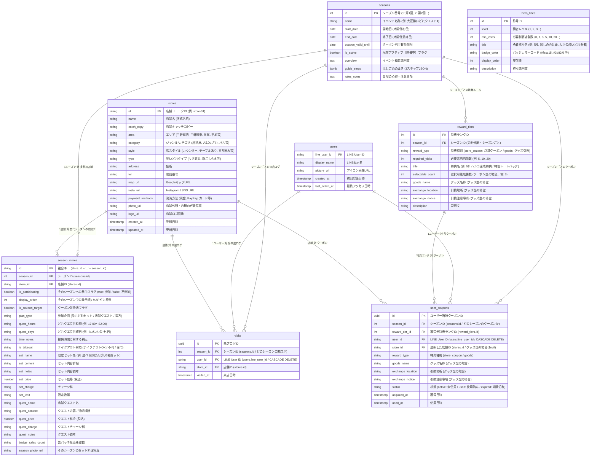
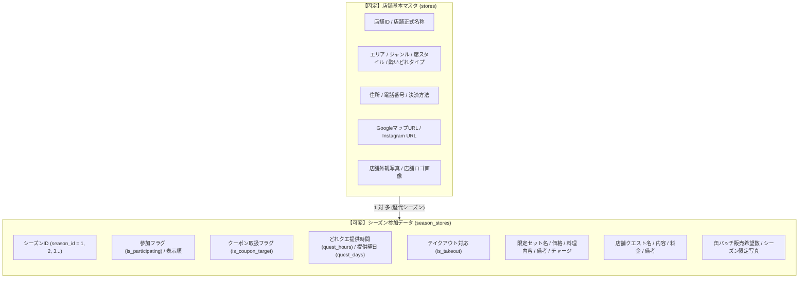
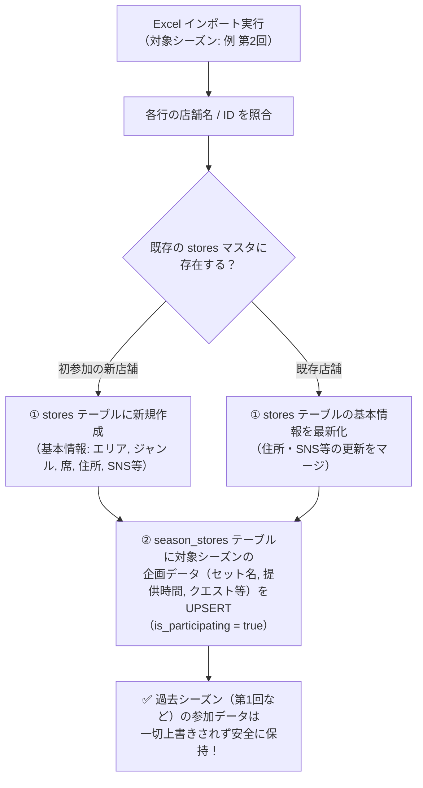

# 大正酔いどれクエスト - システム基本設計・機能仕様書

## 1. 概要と目的

### 1.1 プロジェクト概要
「大正酔いどれクエスト」は、大正区内の飲食店を巡る街ぶら・はしご酒イベント「大正酔いどれクエスト」の公式ガイド＆参加型クエストWebアプリです。

第1回イベントで好評だった「冒険の書（紙）」に店主が手書きサインを書くという**アナログな交流体験**を維持しながら、第2回以降では**LINE公式アカウントと連動したデジタル機能（店主サイン受取・酒場訪問記録・クーポン＆グッズ獲得・店頭消し込み）**を導入し、参加者の利便性向上とリピート促進・周遊促進を実現します。

### 1.2 主な目的
1. **LINE公式アカウントの友達獲得とエンゲージメント強化**: 参加導線をLINE公式アカウントに一本化。過去回次の友だち全員をそのまま引き継ぎ可能。
2. **スマートな酒場訪問（店主サイン受取）記録**: 各店舗に設置されたQRコードを読み取るだけで、店舗スタッフやお客さんに負担をかけずにのべ来店数を冒険の書に記録。
3. **オンデマンド酒場クーポン方式（回数券チケット）＆直感的な一体型UI**: 宝箱開封時に全店舗を事前決定する負担 the なくし、宝箱開封で「クーポン利用可能枠（例: 5回分）」を一括獲得。来店時にその都度1店舗ずつ選んで消し込みを行う回数券チケット方式を導入。冒険の書の特典カード内で「進捗・獲得・残回数・利用履歴」を一元管理。
4. **店舗詳細画面からのダイレクト利用導線**: クーポン対象店舗の詳細画面にもクーポン残枠数と利用ボタンを配置し、店頭での提示・消し込みをスムーズに誘導。
5. **フェーズに応じたクーポン利用制御**: 本開催中（サイン集め期間）はクーポンの消し込みをロックし、イベント終了翌日〜有効期限までの期間に店舗で使える運用を確立。
6. **確実な店頭消し込み**: 特典利用時に店舗スタッフがスマホ画面上で消し込み操作を実行し、規定回数の使い切りで特典コンプリート。二重利用を防止。
7. **安全な並行運用アーキテクチャ**: 9月末まで稼働している現行イベント・クーポンを一切阻害せず、同じLINEプロバイダー内で完全に共存・切り替え可能な設計。
8. **シーズン制（回次管理）アーキテクチャ**: 第2回、第3回、第4回…とソースコードの再構築なしにバックオフィスからワンクリックで開催回を切り替えられる設計。
9. **バックオフィスデータ管理（完全リセット・削除・状態復元）**: 管理画面からユーザー、来店ログ、クーポン、特典ランク、称号マスタを個別・一括で安全に登録・削除・状態変更できる運用設計。

---

## 2. システム構成・アーキテクチャ

```mermaid
flowchart TD
    subgraph LINE [LINE プラットフォーム (プロバイダー: 大正酔いどれ)]
        LineOA[大正酔いどれ公式<br/>(Messaging API / 既存友だち)]
        CurrentLIFF[現行クーポンLIFF<br/>(9月末まで通常稼働)]
        LIFF[大正酔いどれクエスト LIFF<br/>(LIFF ID: 2011637649-WWv6pnTL)]
    end

    subgraph Client [クライアント (Webアプリ / GitHub Pages)]
        App[レトロRPG風 Webアプリ<br/>HTML5 / CSS3 / JavaScript]
        QRScanner[店頭QRコード読み取り<br/>①通常スマホカメラ / ②アプリ内スキャナー]
        CouponUI[冒険の書 / 一体型特典カード / 店頭消し込みUI]
        NoticeBanner[開催・クーポン利用期限動的バナー]
    end

    subgraph Backend [バックエンド (Supabase BaaS / Single Source of Truth)]
        Auth[LINE UID 認証・ユーザー管理]
        DB[(PostgreSQL データベース<br/>seasons / stores / users / visits / user_coupons / reward_tiers / hero_titles)]
        Storage[(店舗ロゴ / 写真画像)]
    end

    subgraph Admin [バックオフィス運営管理システム (admin.html)]
        Dashboard[KPIダッシュボード / ランキング]
        Analytics[店舗・特典別 集計分析 / ソート・CSV]
        StoreManage[店舗マスターCRUD / 特典対象ON/OFF]
        SeasonManage[シーズン作成・開催日程・アクティブ切替]
        TierManage[特典ランクCRUD (クーポン型/グッズ型)]
        TitleManage[勇者レベル・称号マスタ管理]
        DataManage[ユーザー・来店ログ・クーポン削除 & 状態復元]
        POPGen[全店舗A4卓上POP一括印刷・QR生成]
    end

    LineOA -->|トーク画面・リッチメニューから起動| LIFF
    LIFF -->|LINE UID / プロフィール連携| App
    App -->|リアルタイムデータ送受信| Backend
    QRScanner -->|店主サイン受取 (?checkin=store-XX)| App
    NoticeBanner -->|フェーズ状態判定| App
    Admin -->|運営・削除・設定変更| DB
```

---

## 3. ユーザー体験（UX）フロー

```mermaid
sequenceDiagram
    autonumber
    actor User as 参加者 (お客さま)
    actor Shop as 店舗 / スタッフ
    participant LINE as LINE公式アカウント / LIFF
    participant App as 酔いどれクエストアプリ
    participant DB as データベース (Supabase)

    Note over User, LINE: 1. イベント参加・LINE連携
    User->>LINE: 公式LINEトーク画面から「クエスト開始」タップ
    LINE->>App: LIFF起動（LINEユーザーID・表示名・アイコンを自動取得）
    App->>DB: ユーザー登録確認・自動同期 (usersテーブル)
    App-->>User: レトロRPGスタート画面（冒険の書オープン）

    Note over User, Shop: 2. 酒場訪問 ＆ 店主サイン受取
    User->>Shop: 入店・注文（「酔いどれセット」や「店舗クエスト」）
    User->>App: ボトムナビ「📷 QR読取」より店頭QRを読み取る
    App->>DB: 来店ログ記録 (user_id, store_id, season_id, visited_at)
    App-->>User: 「〇〇酒場 を冒険の書に記録した！」（ファンファーレ演出＆✅冒険済マーク）

    Note over User, App: 3. はしご達成 ＆ クーポン利用可能化
    User->>App: 規定軒数（例: 5軒・10軒・20軒）はしご達成
    App-->>User: 冒険の書の特典カードが「✨ 利用可能 (残り X / Y 店舗)」に変化
    alt 酒場クーポン型特典（ダイレクト店舗選択 ＆ USEDスタンプ）
        User->>App: 「🎁 宝箱を開けてお店を選ぶ」をタップ（即座に対象全店舗一覧モーダルを表示）
        User->>App: 未使用の対象酒場を1店タップ（利用済みの店舗はUSEDスタンプで選択不可）
        App-->>User: 「🎟️ クーポン店頭提示画面」を表示
    else 記念品・グッズ引換型特典
        User->>App: 「🎁 記念品引換券を受け取る」をタップ ➔ グッズ引換券を獲得
        App->>DB: グッズ引換券データを保存 (reward_type: 'goods')
        App-->>User: 「🎁 記念品引換券を獲得しました！」
    end

    Note over User, Shop: 4. 来店時の店頭消し込み ＆ 履歴即時反映
    User->>Shop: 店舗へ来店・お会計時に提示
    alt 冒険の書から利用する場合
        User->>App: 宝箱を開けて選択した店舗の消し込み画面を提示
    else 店舗詳細画面から利用する場合
        User->>App: 店舗詳細画面の「🍺 クーポンを使う」をタップして消し込み画面を提示
    end
    alt 本開催期間中（クーポン利用期間前）
        App-->>User: 「🔒 クーポン利用期間前（📅 イベント終了翌日〜）」案内表示（消し込みボタン無効化）
    else クーポン利用期間内（後夜祭フェーズ）
        Shop->>App: スタッフ専用「使用済みにする」ボタンをタップ
        App->>DB: 該当店舗のクーポン消し込みレコードを保存 (status='used')
        App-->>User: ファンファーレ演出 ＆ 冒険の書に利用店舗名が履歴追加され、残回数が更新される
    end
        App-->>User: 消し込み完了スタンプ（USED）表示 ＆ 冒険の書カードの残回数が減少（例: 4/5回）
        Note over App: 規定回数をすべて使い切ると「🏆 完了 (全回数利用済)」に昇格
    end
```

---

## 4. データベース設計 (Supabase / PostgreSQL)



---

## 5. 実装機能一覧

| モジュール | 機能名 | 詳細・運用仕様 |
| :--- | :--- | :--- |
| **ユーザーアプリ** | **ボトムナビゲーション構成** | 【🍺 案内所】➔【🏮 酒場一覧】➔【📜 冒険の書（中央配置）】➔【📷 QR読取（フラット通常デザイン）】➔【📍 マップ】の5項目で統一。 |
| **ユーザーアプリ** | **酒場一覧（今期専有・過去非遷移）** | 迷いや誤認を防止するため、酒場一覧・店舗詳細画面は**常に現在開催中（アクティブ）のシーズンに参加している店舗（`is_participating = true`）と今期のセットメニューのみ**を表示。過去シーズンへの遷移は行わない。 |
| **ユーザーアプリ** | **冒険の書（歴代アーカイブ閲覧）** | 自分の冒険の思い出・達成履歴として、上部セレクターで「第1回の冒険の書」などを振り返り閲覧可能（過去回は読み取り専用でQR読取等はロック）。ロゴコレクションは**選択中シーズンに参加している店舗のみ**を動的に整列表示。 |
| **ユーザーアプリ** | **案内所（トップガイダンス）** | 現在開催中シーズンの概要・はしご酒の導き（3ステップ）・冒険の心得を動的表示。 |
| **ユーザーアプリ** | **アプリ内蔵カメラQRリーダー** | ボトムナビ「📷 QR読取」から即座にWebカメラを起動し、店頭卓上POPのQRコードを高速スキャン。現在開催中シーズンの来店ログ（`visits` に `season_id` 紐付け）として自動記録。今期不参加店舗のスキャン時はエラー警告を表示。 |
| **ユーザーアプリ** | **外部カメラ直接サイン受取** | スマホ標準カメラやLINE QRリーダーからの読み取り時も、自動ログイン後にシームレスに来店記録を実行。 |
| **ユーザーアプリ** | **RPG風達成演出モーダル** | サイン受取成功時にファンファーレとともに「店舗名」「制覇数」「宝箱アンロック通知（クーポン型／グッズ型自動判別）」をリッチに表示。 |
| **ユーザーアプリ** | **1シーズン1店舗1回制限** | 同一シーズン・同一店舗への重複スキャン時は「すでに冒険の書に記録済みです」と案内し、二重カウントを確実に防止（別シーズンへの来店は新規記録可能）。 |
| **ユーザーアプリ** | **開催フェーズ動的バナー** | 本開催中・後夜祭（クーポン利用期間）・期間終了の3状態を自動検知してヘッダーにリアルタイム告知。 |
| **ユーザーアプリ** | **クーポン規定数完全選択** | 選択モーダルには**今期参加（`is_participating = true`）かつクーポン対象（`is_coupon_target = true`）**の店舗のみを一覧表示。規定数（例: 5店舗）すべてを選択するまで確定ボタンをロックし、誤操作による権利消失を防止。 |
| **ユーザーアプリ** | **クーポン利用期間制御** | 本開催期間中はクーポン消し込みをロックし「📅 イベント終了翌日〜利用可能」の旨を表示。後夜祭期間に消し込みボタンを有効化。 |
| **ユーザーアプリ** | **記念品・グッズ引換対応** | 店舗クーポン型（`[🍺 店舗クーポン]`）だけでなく、トートバッグやTシャツ等のグッズ引換型（`[🎁 グッズ引換]`）の種別バッジ、引換場所・注意事項の表示および店舗/本部消し込みに対応。 |
| **ユーザーアプリ** | **酒場ロゴコレクション（図鑑風タイル）** | 冒険の書のハシゴ済み酒場エリアを選択中シーズンの参加全店舗ロゴタイルグリッドで表示。未制覇は暗転・反転、制覇でカラー＆ゴールド発光点灯。タップで店舗名・訪問日時確認・詳細遷移モーダルを表示。 |
| **バックオフィス** | **全機能シーズンセレクター連動** | ダッシュボード、店舗管理、シーズン設定、特典ランク、称号、集計分析のすべてが選択中シーズン（第1回/第2回/第3回…）と完全に連動。 |
| **バックオフィス** | **店舗マスター2層分離管理** | 店舗の基本情報（`stores`）と、各シーズンの参加状況・企画メニュー（`season_stores`）を独立管理。過去シーズンのデータを壊さず安全に保持。 |
| **バックオフィス** | **アンケートExcel自動2層振分取込** | Googleフォーム集計結果のExcel（全38列）を解析し、対象シーズンを指定して「店舗基本マスタ更新」と「シーズン参加データUPSERT」を同時に実行。 |
| **バックオフィス** | **シーズン別 特典ランク・宝箱管理** | シーズンごとに独立した特典マイルストーン（必要軒数・クーポン型/グッズ型・引換設定）をGUIで完全作成・編集・削除。 |
| **バックオフィス** | **店舗・特典別 集計分析 (Analytics)** | 選択中シーズンの来店数・クーポン指名数・店頭消し込み実績一覧（ソート・エリア絞り込み対応）、およびCSV出力をサポート。 |
| **バックオフィス** | **全店舗POP一括印刷** | 全店舗の卓上QRコードPOP（A4レイアウト）を即座に印刷・PDF出力。 |

---

## 6. 店舗マスター 2層分離 ＆ アンケートExcelインポート仕様

### 6.1 店舗データの2層分離アーキテクチャ

イベントの継続開催・発展に伴い、店舗の「普遍的な基本情報」と「シーズンごとに変わる企画内容」を完全に分離して管理します。



---

### 6.2 画面別のシーズン表示仕様（整合性ルール）

| 画面 | シーズン切替 | 表示仕様・方針 |
| :--- | :---: | :--- |
| **🍻 酒場一覧・店舗詳細** | **不可**<br/>（今期固定） | **常に現在開催中（アクティブ）のシーズンに参加している店舗（`is_participating = true`）と今期企画メニューのみを表示**。<br/>一般参加者の迷いや店舗での注文トラブルを防止するため、過去シーズンの店舗リストへは遷移させない。 |
| **📜 冒険の書（パスポート）** | **切替可能**<br/>（アーカイブ） | **参加者自身の冒険の思い出・達成履歴**として、上部セレクターで「第1回の制覇記録」を振り返り閲覧可能。<br/>（※過去回は読み取り専用とし、QR読取やクーポン使用ボタンは誤操作防止のためロック） |
| **🏠 案内所（トップ）** | **不可**<br/>（今期固定） | **現在開催中シーズンの概要文・はしご酒の導き（3ステップ）・冒険の心得（注意事項）・および参加店舗（`is_participating = true`）に基づく動的コマンド選択件数（エリア数・ジャンル数・席スタイル数・タイプ数・対応中件数・総件数）を表示**。<br/>各探す画面で展開される選択肢の件数と100%動的連動。 |
| **💻 バックオフィス（管理画面）** | **全画面切替可能** | 管理者は「第1回」「第2回」「第3回」を自由に切り替え、それぞれの参加店舗・セット内容・特典・集計ログを閲覧・編集可能。 |

---

### 6.3 アンケートExcelの自動2層振分インポート仕様

運営事務局がシーズンごとに収集する店舗アンケート（Googleフォーム集計Excel: 全38列）を取り込む際、**指定したシーズンIDに対して安全に自動2層振り分け**を実行します。



---

### 6.4 Excel列 ➔ データベース（stores / season_stores）項目対照表

| Excel列（全38列） | 格納先テーブル | カラム・キー名 | 型 | 画面・用途 |
|---|---|---|---|---|
| A: タイムスタンプ | - | *(取込判定用)* | string | - |
| B: 店名 | `stores` | `name` | string | 酒場名（正式名称） |
| C: 参加意思 | `season_stores` | `is_participating` | boolean | 今期参加フラグ (`true` / `false`) |
| D: エリア | `stores` | `area` | string | エリアバッジ (三軒家西/東/駅前/泉尾/平尾) |
| E: カテゴリ | `stores` | `category` | string | ジャンル/カテゴリ (居酒屋, おばんざい等) |
| F: スタイル | `stores` | `style` | string | 席スタイル (カウンター, テーブル等) |
| G: タイプ | `stores` | `type` | string | 酔いどれタイプ (サク飲み, 腹ごしらえ等) |
| H: テイクアウト | `season_stores` | `is_takeout` | string | 今期のテイクアウト対応 (OK/不可/専門) |
| I: 提供曜日 | `season_stores` | `quest_days` | string | 今期の提供曜日 (`月,火,水,木,金,土`) |
| J: 開始 / K: 終了 | `season_stores` | `quest_hours` | string | 今期の提供時間 (`17:00〜22:00`) |
| L: 提供時間補足 | `season_stores` | `time_notes` | string | 提供時間補足バッジ (`土日祝は15時〜`) |
| M: 決済方法 | `stores` | `payment_methods` | string | 利用可能な決済方法 (現金, PayPay, カード) |
| N: クーポン希望 | `season_stores` | `is_coupon_target` | boolean | 今期のハシゴ達成クーポン取扱店フラグ |
| O: 参加企画 | `season_stores` | `plan_type` | string | 企画種別 (セット / クエスト / 両方) |
| P / AA: セット名 | `season_stores` | `set_name` | string | 今期の酔いどれセット名 |
| Q / AB: セット内容 | `season_stores` | `set_content` | string | セット内容詳細 |
| R / AC: セット備考 | `season_stores` | `set_notes` | string | セット内容備考・注記 |
| S / AD: 価格(税込) | `season_stores` | `set_price` | number | セット価格 (`¥1,000`) |
| T / AE: チャージ料 | `season_stores` | `set_charge` | string | チャージ料 (`不要` / `¥300`) |
| U / AF: 限定数量 | `season_stores` | `set_limit` | string | 限定数量 (`無くなるまで`等) |
| V / AG: クエスト名 | `season_stores` | `quest_name` | string | 店舗クエスト名 |
| W / AH: クエスト内容 | `season_stores` | `quest_content` | string | クエスト達成条件・報酬 |
| X / AI: 料金(税込) | `season_stores` | `quest_price` | number | クエスト参加料金 |
| Y / AJ: クエストチャージ | `season_stores` | `quest_charge` | string | クエストチャージ料 |
| Z / AK: クエスト備考 | `season_stores` | `quest_notes` | string | クエスト注意事項 |
| AL: 缶バッチ希望数 | `season_stores` | `badge_sales_count` | string | 参加証(缶バッチ)販売希望数 |
| *(永続)* キャッチコピー | `stores` | `catch_copy` | string | 酒場カードのサブコピー |
| *(永続)* Google Map URL | `stores` | `map_url` | string | GoogleマップURL |
| *(永続)* Instagram URL | `stores` | `insta_url` | string | Instagram URL |
| *(永続)* 店舗写真 | `stores` | `photo_url` | string | 店舗代表写真 (`photo/001.jpg`) |
| *(永続)* 店舗ロゴ | `stores` | `logo_url` | string | 店舗ロゴ画像 (`logo/001.png`) |

---

### 6.4 データ型・クレンジング・正規化ルール

1. **提供時間（`hours`）**:
   - Excel内部の小数シリアル値（例: `0.5`, `0.625`, `0.708`）やTime型を判定し、`HH:mm〜HH:mm` 形式（例: `15:00〜22:30`, `12:00〜00:00`）へ自動変換。
2. **提供曜日（`days`）**:
   - `全て` ➔ `月,火,水,木,金,土,日`
   - 「月曜日」「火曜日」等の「曜日」の「日」に誤爆しないよう正規表現（`/日曜日|日曜/`）で厳密に判定し、`月,火,水,木,金,土` 形式に正規化。
3. **価格・料金（`set_price`, `quest_price`）**:
   - `800円(税込)`, `2,000円`, `1000` などの文字列から数字のみを抽出し、**数値型（`number`）** として格納。
4. **チャージ料・限定数量（`set_charge`, `set_limit` 等）**:
   - `None` や空文字は `不要` または `""` にクレンジングし、酒場の自由記述（例: `酔いどれセットの方は０円`, `おばんざいが無くなるまで。`）をそのまま尊重して保持。
5. **スタイル（`style`）**:
   - `テールブあり` などの誤字補正を行いながら、`カウンターメイン、テーブル1席あり` などの詳細記述をそのまま維持。
6. **既存マスタ情報保護（写真・ロゴ・地図URL・キャッチコピー）**:
   - アンケートExcelに含まれないシステム管理項目（`photo_url`, `logo_url`, `map_url`, `insta_url`, `catchphrase`）は、インポート時に既存マスタ（DB）の値を自動継承し、空文字上書きを防止。

---

### 6.5 2層データモデルのスキーマ定義（stores ＋ season_stores）

データベースでは、店舗の基本マスタ（`stores`）と、各シーズンごとの参加企画データ（`season_stores`）を以下の構造で管理・連携します。

#### ① 店舗基本マスタ（`stores`）
```json
{
  "id": "store-01",
  "name": "Tようび",
  "catchphrase": "牛すじとお酒とおばんざい",
  "area": "三軒家西",
  "category": "おばんざい",
  "style": "テーブルあり",
  "type": "サク飲み",
  "address": "大阪市大正区三軒家西...",
  "tel": "06-xxxx-xxxx",
  "payment_methods": "現金, PayPay, クレジットカード",
  "map_url": "https://maps.app.goo.gl/zEmF7y9d2rdJpG8a7",
  "insta_url": "https://www.instagram.com/t_youbi_",
  "photo_url": "photo/001.jpg",
  "logo_url": "logo/001.png"
}
```

#### ② シーズン参加・企画データ（`season_stores`）
```json
{
  "id": "store-01_2",
  "season_id": 2,
  "store_id": "store-01",
  "is_participating": true,
  "display_order": 1,
  "is_coupon_target": true,
  "plan_type": "「酔いどれセット」のみで参加",
  "is_takeout": "テイクアウトOK",
  "quest_days": "火,水,木,金,土,日",
  "quest_hours": "17:00〜22:00",
  "time_notes": "土日祝は15時～22時",
  "set_name": "選べるおばんざい3種セット",
  "set_content": "おばんざい小盛3種+ドリンク1杯",
  "set_price": 800,
  "set_charge": "酔いどれセットの方は０円",
  "set_limit": "おばんざいが無くなるまで。",
  "set_notes": "数種類あるおばんざいから3種類選べます。",
  "quest_name": "",
  "quest_content": "",
  "quest_price": 0,
  "quest_charge": "不要",
  "quest_notes": "",
  "badge_sales_count": "",
  "season_photo_url": ""
}
```

---

### 6.6 バックオフィス店舗入力・編集画面（admin.html）の連携仕様

1. **席スタイル（`style`）の自由記述対応**:
   - 既定選択肢（`テーブルあり`, `カウンター`, `立ち飲み`, `テイクアウト専門`）に加え、`その他 (直接入力)` をサポート。
   - アンケートで自由入力された詳細（例: `カウンターメイン、テーブル1席あり`）を丸めずに保持・編集可能とする。
2. **参加企画（`plan_type`）の選択**:
   - `両方で参加` / `「酔いどれセット」のみで参加` / `「店舗クエスト」のみで参加` のプルダウン選択。
3. **新規シーズン作成時の店舗データ初期化・引継ぎ**:
   - 新規シーズン作成時は、初期状態で全店舗が「未参加」として安全に作成される。
   - アンケートExcelのインポート、または「前シーズンの参加店舗設定を一括コピー」操作により、瞬時に新シーズンの参加店舗マスタを構築可能。
4. **決済方法（`payment`）の双方向同期**:
   - チェックボックス（現金/カード/PayPay等）と、「その他決済」テキスト欄を組み合わせて自由記述（QR決済の種類等）を漏れなく保持。
5. **店舗情報の確実な保存・即時反映（CRUD安定化）**:
   - 既存店舗の編集保存時は、選択中シーズンに対応する `season_stores` と基本マスタ `stores` の双方へ安全に保存を実行。

---

## 7. 店舗・特典別 集計分析機能（Analytics）の仕様

バックオフィス管理画面に新設された「📊 店舗・特典集計」画面（`#analytics`）は、**選択中シーズン（第1回/第2回/第3回…）に絞り込んで**、イベント開催中の動向分析や、イベント終了後の各参加店舗への実績フィードバック（送客数・クーポン精算データ）を即座に集計・出力するための機能です。

### 7.1 全店舗 実績集計一覧
1. **集計指標（選択中シーズン `season_id` で完全フィルタリング）**:
   - **📷 サイン受取数（来店数）**: 選択中シーズンにおいて該当店舗の店頭QRコードがスキャンされたユニーク来店数（`visits WHERE season_id = selectedSeasonId`）。
   - **🎟️ クーポン獲得（指名）数**: 選択中シーズンにおいて参加者がはしご達成特典として該当店舗のクーポンを選択・獲得した総数（`user_coupons WHERE season_id = selectedSeasonId`）。
   - **🍺 クーポン利用数（店頭消し込み）**: 選択中シーズンにおいて実際に店舗で提示され、スタッフにより消し込み操作された総数（`user_coupons WHERE season_id = selectedSeasonId AND status = 'used'`）。
   - **📈 利用率 (%)**: `(利用数 ÷ 獲得数) × 100` で算出。
2. **操作・絞り込み機能**:
   - **シーズン連動**: シーズンセレクターを切り替えると、そのシーズンの参加店舗のみを対象に即時再集計。
   - **検索**: 店舗名・店舗IDでのインクリメンタル検索。
   - **エリアフィルター**: 三軒家西、三軒家東、泉尾、平尾などのエリア別絞り込み。
   - **ソート**: サイン受取数順（降順/昇順）、クーポン獲得数順、利用消し込み数順、利用率順、店舗ID順での並び替え。
   - **CSV出力**: 選択中シーズンの全参加店舗実績テーブルデータをExcel互換（UTF-8 BOM付き）CSVとしてワンクリックダウンロード。

---

## 8. 冒険の書「酒場ロゴコレクション」UI仕様

冒険の書画面の「ハシゴ済み酒場」エリアは、選択中シーズンに参加している全店舗のロゴをタイルのようにグリッド配置した**図鑑風コレクションUI**として設計されています。

### 8.1 タイル表示ルール
1. **選択中シーズンの参加全店舗グリッド配置**:
   - 選択中シーズンに参加している全店舗（`season_stores.is_participating = true`）を動的に抽出し、表示順（`display_order` または店舗ID連番）で整列。
   - スマートフォン幅で4列（幅広画面で5列）の正方形タイル（アスペクト比 1:1）で一覧表示。
2. **未制覇（サイン未受取）**:
   - 明るめのグレースケール（白黒 ＋ 透過度75% ＋ 明るさ90% ＋ `#1e293b` 背景）。
   - まだ訪れていない場所でもロゴの形状・シンボルがはっきりと視認でき、探索意欲を向上。
3. **制覇済み（サイン受取後）**:
   - フルカラー ＋ ゴールド発光枠 ＋ ネオンシャドウ（`border-color: #facc15; box-shadow: 0 0 10px rgba(250, 204, 21, 0.45);`）。
   - 巡れば巡るほどタイルが明るく点灯し、コレクションの達成感を最大化。
4. **表示のミニマリズム**:
   - タイル盤面上には通し番号や店舗名、日時のテキストを一切配置せず、**ロゴ画像のみ**をクリーンに整列。

### 8.2 インタラクション（タップ時の店舗確認モーダル）
- ロゴタイルをタップすると、レトロRPG風の「📜 酒場コレクション確認モーダル」がポップアップ。
  - **店舗ロゴ（拡大・カラー）**
  - **店舗名 ＆ エリア・カテゴリ**
  - **制覇ステータス**（制覇済みの場合は「✨ 制覇済み（YYYY/MM/DD HH:mm 記録）」、未制覇の場合は「🔒 未制覇」）
  - **「🏮 酒場詳細を見る」ボタン**（店舗個別詳細画面へダイレクト遷移）

---

## 9. データ取得・フォールバック偽装の完全禁止規約 (Strict Data Integrity Policy)

本システム（ユーザーアプリ、バックオフィス管理画面、API通信層の全領域）において、**データ欠損・未定義時にコード内の固定値（ダミー文字列・仮データ）を代入・フォールバック表示して正常に見せかける実装を恒久的に全面禁止**とします。

### 9.1 禁止事項（Anti-Patterns）
1. **未定義プロパティに対する固定文字列・固定値の暗黙補填の禁止**:
   - `newHero?.title || '初陣'`、`newHero?.level || 2`、`season.name || '大正酔いどれクエスト'` のように、プロパティが存在しない・取得できない場合にコード内の固定値をフォールバック代入する処理の禁止。
2. **引数不整合やデータ欠損の隠蔽の禁止**:
   - 呼び出し側の引数エラーやオブジェクト構造の不整合が発生した際、デフォルト値で画面を成立させてバグを正常に見せかける処理の禁止。
3. **データベース設定に存在しないダミーマスタのハードコード禁止**:
   - データベース（Supabase）上に登録されていない店舗情報、特典ランク、勇者称号、ガイダンス・心得、シーズン設定等をプログラム内に固定値として埋め込み、それを代替表示する処理の禁止。

### 9.2 遵守すべきデータ設計・実装原則
1. **データベース（Single Source of Truth）の絶対遵守**:
   - すべての称号、特典、店舗、シーズンデータはデータベースを唯一の真実として扱い、DBマスタから取得した実データを厳格に使用する。
2. **データ欠損・未取得時の明示的ハンドリング**:
   - データが存在しない場合は、勝手な仮データを捏造せず、空状態（`[]`）、未設定表記（例: `-` や未設定メッセージ）、または開発・デバッグ環境で即座に検知可能なログ・エラーハンドリングを行う。
3. **引数シグネチャの厳密な型・構造チェック**:
   - コンポーネントやモーダル関数は、期待するオブジェクト構造を明確にし、データ不整合時はフォールバックで誤魔化さず根本原因を即座に特定・修正できる構造を維持する。

---

## 10. バージョン改定履歴 (Changelog)

| バージョン | 改定日 | 主な改定内容 |
| :--- | :--- | :--- |
| **v2026.09.21.17** | 2026-09-21 | **冒険の書USEDハンコ配置最適化（カード右上・大型半透明オーバーレイ） ＆ 利用済ラベル削除 ＆ 履歴リスト赤色枠統一**<br>・【USEDハンコ配置 ＆ 大型半透明化】冒険の書特典カードにおいて、下部の小さなハンコ枠を廃止。従来の「受取完了」「特典コンプリート」ラベルの位置（カード右上）に、文字と重なっても自然に見える大型半透明の斜めハンコ（`.treasure-card-stamp-used`、22px、-10deg、赤色二重線枠）をオーバーレイ配置。<br>・【不要ラベルの撤廃】「📦 受取完了」「👑 特典コンプリート」ラベルを削除し、USEDハンコのみで直感的に達成状態を表現。<br>・【利用済み履歴の赤色枠統一】CSS（`.tier-usage-item.used`）に残存していた緑色の枠線・背景色（`rgba(16, 185, 129, ...)`）を完全撤廃し、赤色系（`rgba(239, 68, 68, ...)`）に統一。<br>・システム共通バージョンを `v2026.09.21.17` に更新。 |
| **v2026.09.21.16** | 2026-09-21 | **USED斜めハンコ（スタンプ）UI全面統一 ＆ 打刻アニメーション・スタンプSE導入 ＆ 利用済リスト視覚改善 ＆ ダイアログ行サイズ調整**<br>・【USED斜めハンコ化】「USED/受取済」「USED(利用済)」等の文言をすべて「USED」のみに統一。リアルな傾き（-8deg）・二重線枠・かすれ感を再現した斜めハンコバッジ（`.stamp-hanko-badge`）に全画面で刷新。<br>・【スタンプ打刻アニメーション ＆ SE】消し込み完了時に「ポンッ！」と重みのあるスタンプ効果音（`playStampSE()`）をWeb Audio APIで生成・再生し、画面にハンコがドンッと押されるバウンスアニメーション（`.stamp-animate`）を適用。<br>・【全枠利用完了時のUSEDスタンプ化】冒険の書特典カードで全枠利用完了時の「🎉 X軒すべての酒場のご利用完了」バナーを、大きな「USED」斜めハンコ表示に刷新。<br>・【利用済み履歴の赤字統一・チェックアイコン削除】冒険の書のクーポン利用済みリストにおいて、チェックボックスアイコン（`✅`）を撤廃し、USED状態と直感的に一致する赤字（`#f87171`）に統一。<br>・【酒場選択ダイアログの視認性向上】各行の縦幅を `min-height: 56px`（padding: 8px 10px）に拡大し、酒場名フォントを `14px`、ロゴを `38px` に調整してタップしやすさと視認性を向上。<br>・システム共通バージョンを `v2026.09.21.16` に更新。 |
| **v2026.09.21.15** | 2026-09-21 | **スマホ画面（モバイルファースト）最適化 ＆ 未定義プロパティ除去 ＆ 酒場用語の徹底統一**<br>・【未定義プロパティ撤廃】酒場選択ダイアログ内に残存していた未定義プロパティ（`s.specialty`）の参照を完全除去。<br>・【モバイルファースト最適化 ＆ 改行防止】酒場選択ダイアログの各行を1行省略表示（`ellipsis`）＋高さ完全均一化（48px）し、スマホ画面幅（360px〜390px）での上下のガタつきやテキストはみ出しを解消。各ボタン・バッジに `white-space: nowrap;` を適用し不自然な改行を防止。<br>・【酒場用語の世界観統一】ユーザー向け表示テキストにおいて「店舗」「お店」表記を排除し、「酒場」「軒」へ徹底統一。<br>・システム共通バージョンを `v2026.09.21.15` に更新。 |
| **v2026.09.21.14** | 2026-09-21 | **冒険の書「特典枠」ラベル削除 ＆ グッズ引換ワンタップ化 ＆ 酒場クーポン・グッズ店頭スライド消し込みUIの全面統一**<br>・【特典枠ラベル削除】冒険の書ヘッダー（LINE名・称号エリア）に表示されていた不要な「特典: 0枠」ラベルを完全削除。<br>・【グッズ引換操作の大幅簡素化】従来の「宝箱を開ける（GET確認）➔ アラート ➔ 引換券を表示 ➔ 消し込み確認」という過剰ステップを廃止。達成時に「🎁 記念品を受け取る」ボタン1タップで即座に店頭提示画面を開けるようフローを統合。<br>・【スライド消し込み（Swipe to Redeem）UIの統一】「酒場クーポン消し込み」「記念品グッズ受取」の双方に、ドラッグ＆スワイプ対応の「👉 スライドして使用 / 受取」UIを導入。ネイティブダイアログを撤廃し、インライン受取完了演出（🎉 / 🍺）＋ファンファーレSE再生＋自動クローズによるスマートな店頭オペレーションを実現。<br>・システム共通バージョンを `v2026.09.21.14` に更新。 |
| **v2026.09.21.13** | 2026-09-21 | **特典ランクMapキー型不一致（文字列 vs 数値）の解消 ＆ 10軒達成特典カード利用済み反映の是正**<br>・【Mapキー型不一致解消】`tierCouponMap` のキーおよび `reward_tier_id` 参照において、文字列と数値の型不一致（`tier.id: "2"` vs `reward_tier_id: 2`）により10軒達成クーポンの利用済みレコードが未割り当て扱いとなり、先頭の5件達成枠に吸い込まれていた不具合を完全解消。<br>・【ボタンクリック時のID正規化】「🎁 続けてクーポンを使う」ボタン押下時の `tier` 検索も `Number(t.id) === tierId` に正規化し、対象特典ランクへの正確なルーティングを保証。<br>・システム共通バージョンを `v2026.09.21.13` に更新。 |
| **v2026.09.21.12** | 2026-09-21 | **消し込み時特典ランクID（reward_tier_id）の確実保存 ＆ 特典ステータスバッジの簡素化**<br>・【消し込み時のランクID保存是正】`redeemCouponForStore` において、存在しない `season_id` カラムの送信により `reward_tier_id` を含むINSERTがエラーとなっていたフォールバック処理を是正。実在する `reward_tier_id` を最優先で確実にデータベース保存するよう修正。<br>・【利用可能バッジの簡素化】冒険の書の特典カードヘッダーにおいて、「✨ 利用可能 (残り X / Y 店舗)」から残件数表記を除去し、「✨ 利用可能」のシンプルなバッジ表示に変更。<br>・システム共通バージョンを `v2026.09.21.12` に更新。 |
| **v2026.09.21.11** | 2026-09-21 | **シーズン全体を通じた酒場クーポン1店舗1回限りルールの適用 ＆ 特典ランク枠割り当ての最適化**<br>・【1店舗1回限りルール】仕様案A（シーズン全体で同一店舗でのクーポン利用は1回限り）を完全適用。どの特典ランクであれ一度利用した店舗はシーズン中常に「USED (利用済)」となり、再度のクーポン利用をブロック。<br>・【API重複防止】`redeemCouponForStore` においても、シーズン全体で同一店舗の重複消し込みを堅牢に防止。<br>・【スマートランク割り当て】冒険の書の特典カードにおいて、利用済みクーポンを特典ランクの枠数（`selectable_count`）に応じて古い順にスマートに配分し、各ランクの残枠数（残り X / Y 店舗）と利用履歴を正確に表示。<br>・システム共通バージョンを `v2026.09.21.11` に更新。 |
| **v2026.09.21.10** | 2026-09-21 | **クーポン店舗選択モーダルにおけるUSED店舗判定の特典ランク・種別整合化**<br>・【USED判定の不整合解消】「続けてクーポンを使う」から開く店舗選択モーダル（`openStoreSelectForCoupon`）において、無関係なグッズ引換（`store-01` 等）や他ランクの利用済みレコードまで全件USEDとして誤判定していた問題を解消。<br>・冒険の書の特典カードと同様に、対象の特典ランク（`tier.id`）かつ酒場クーポン（`reward_type !== 'goods'`）に厳格に絞り込んで `usedStoreIds` を算出するよう統一。<br>・システム共通バージョンを `v2026.09.21.10` に更新。 |
| **v2026.09.21.09** | 2026-09-21 | **グッズ引換券発行時のスキーマ互換エラー解消 ＆ クーポン登録処理の完全サニタイズ**<br>・【グッズ引換スキーマエラー解消】グッズ引換券獲得時（`claimGoodsReward`）に、Supabaseの `user_coupons` テーブルに存在しないカラム（`exchange_location`, `goods_name`, `reward_type`, `exchange_notice`）を送信して発生していた `PGRST204` エラーを解消。<br>・【全登録処理のサニタイズ】`user_coupons` へのINSERT処理（`claimStoreCouponTier`, `claimCoupons`, `claimGoodsReward`）を一括点検し、実在する基本カラム（`user_id`, `store_id`, `status`, `acquired_at`）＋段階的フォールバック（`season_id`, `reward_tier_id`）に統一してデータベース保存の安全性を完全保証。<br>・システム共通バージョンを `v2026.09.21.09` に更新。 |
| **v2026.09.21.08** | 2026-09-21 | **USED店舗行の視認性保持（縦幅均一化 ＆ 右端USEDバッジ） ＆ 冒険の書利用履歴カードの縦積み配置修正**<br>・【USED行の縦幅均一化】店舗選択ダイアログにおいて、利用済み店舗（USED）の行が潰れてしまう問題を解消。未利用店舗と全く同じ `min-height: 56px`・情報構造（ロゴ、店舗名、エリア/カテゴリ）を維持し、右端に「USED (利用済)」バッジを配置することで視認性を確保。<br>・【利用履歴とボタンの縦積み保証】冒険の書の特典カードアクション領域（`.treasure-tier-action`）を `flex-direction: column` かつ全幅（`width: 100%`）に固定し、「▼ クーポン利用済み」一覧の下部に「🎁 続けてクーポンを使う」ボタンが必ず配置されるようレイアウトを是正。<br>・システム共通バージョンを `v2026.09.21.08` に更新。 |
| **v2026.09.21.07** | 2026-09-21 | **クーポン利用店舗選択ダイアログの冗長な「酒場特典あり」表記の完全撤廃**<br>・対象店舗のみが表示されるクーポン店舗選択モーダルにおいて、全店に一律で表示されていた「酒場特典あり」固定文字列を完全撤去。<br>・第9章「データ取得・フォールバック偽装の完全禁止規約」に準拠し、店舗固有の実データ（エリア・カテゴリ・名物など）のみをシンプルに表示する設計に最適化。<br>・システム共通バージョンを `v2026.09.21.07` に更新。 |
| **v2026.09.21.06** | 2026-09-21 | **クーポン獲得メッセージの完全撤廃（即座に店舗選択表示） ＆ 店頭消し込みスキーマ互換エラーの修正**<br>・【即時モーダル展開】「🎁 宝箱を開けてお店を選ぶ」ボタン押下時に重複発火していた古い獲得確認ダイアログ（「～獲得しますか？」「🎉 おめでとうございます！」）を完全撤廃し、ボタン押下で即座に店舗選択ダイアログを表示。<br>・【スキーマ互換性】Supabaseの `user_coupons` テーブルに `reward_type` カラムが存在しないことに起因する消し込みエラー（`PGRST204`）を修正。必須カラムによる安全なINSERTと段階的フォールバックを実装し消し込み処理を完全保証。<br>・システム共通バージョンを `v2026.09.21.06` に更新。 |
| **v2026.09.21.05** | 2026-09-21 | **酒場クーポン利用フローのダイレクト店舗選択化 ＆ USEDスタンプ・カード内利用履歴UIの実装**<br>・【ワンタップ店舗選択】「解放可能」表記を「利用可能」に刷新し、「🎁 宝箱を開けてお店を選ぶ」ボタンを押した時点で即座に対象全店舗の選択モーダルを開く直感的なフローに統合。<br>・【USEDスタンプ】一度利用した店舗には「USED」ハンコ（スタンプ）を表示し、同一店舗での重複利用を防止・グレーアウト。<br>・【カード内履歴表示】冒険の書の各特典カード上部に、利用済み店舗名と日時（✅ 〇〇酒場）および残枠数（残り X / Y 店舗）を一覧表示。<br>・【店舗詳細連動】店舗詳細画面のクーポン利用ボタンからも直接店頭消し込みができるよう整合化。<br>・システム共通バージョンを `v2026.09.21.05` に更新。 |
| **v2026.09.21.04** | 2026-09-21 | **レベルアップ演出呼び出し引数の正規化 ＆ 固定値フォールバックの完全撤廃**<br>・冒険の書のテストサイン機能において、`showLevelUpModal` へ渡す引数を正規のオブジェクト構造に是正し、「undefined軒達成」および「Lv.1 初陣固定化」バグを解消。<br>・第9章「データ取得・フォールバック偽装の完全禁止規約」に準拠し、`showLevelUpModal` 内の固定文字列・固定レベル代入（`|| '初陣'`, `|| 2` 等）を撤廃。<br>・システム共通バージョンを `v2026.09.21.04` に更新。 |
| **v2026.09.21.03** | 2026-09-21 | **冒険の書テスト機能（一括サイン記録・履歴リセット）のメソッド名不整合解消 ＆ 安全性強化**<br>・`js/app.js` と `js/api.js` 間でテスト用メソッド名（`addMockVisits` / `recordMultipleVisitsForTest`、`resetVisitsAndCoupons` / `resetUserVisitsAndCouponsForTest`）が不一致となっていた不具合を解消し、両エイリアスを整備。<br>・テストサイン記録および履歴リセット時に、エラー発生時でもボタン状態が復元されるよう `try...finally` ガードを適用。<br>・システム共通バージョンを `v2026.09.21.03` に更新。 |
| **v2026.09.21.02** | 2026-09-21 | **冒険の書テンプレート重複コード混入バグの解消 ＆ クリーンアップ**<br>・`v2026.09.21.01` での冒険の書UI統合時に `js/app.js` のテンプレートリテラル末尾に誤って混入していた重複ブロック・構文エラーを完全除去。<br>・ロード時のスクリプトクラッシュおよびそれに伴う「PUSH START」ボタンのイベント不発障害を解消。<br>・不要な暫定コード（インラインハンドラーや過剰なリスナー）を撤廃し、クリーンな設計に復元。<br>・システム共通バージョンを `v2026.09.21.02` に更新。 |
| **v2026.09.21.01** | 2026-09-21 | **酒場クーポンの新仕様（オンデマンド店頭その都度選択・回数券チケット方式 ＆ 宝箱/クーポン完全一体型UI）の実装**<br>・【新仕様】宝箱開封時に全店舗を事前決定する負担を廃止し、宝箱を開けた時点で「クーポン利用可能枠（例: 5回分）」を一括付与する回数券チケット方式に刷新。<br>・【店頭その都度選択】行く店が決まった時や来店時に「🏮 お店を選んでクーポンを使う」から対象店舗を選択し、即座に店頭消し込みを実行。利用した店舗ごとに1回分ずつ消費。<br>・【一体型UI】冒険の書で「特典宝箱」と「所持クーポン一覧」を分断せず、各特典ランクカード内で進捗・獲得・残回数（X/Y回）・利用履歴（店舗名と日時）を一元表示。<br>・【店舗詳細画面の導線】クーポン対象店舗の詳細画面にも「🎟️ このお店でクーポンを使う（残り○回）」ボタンを配置し、店頭で直接消し込みモーダルを呼び出せる導線を追加。<br>・【管理画面・CSV対応】未割り当てクーポン（`store_id: null`）およびグッズ引換券の集計・履歴一覧表示・CSV出力を最適化。<br>・システム共通バージョンを `v2026.09.21.01` に更新。 |
| **v2026.09.20.09** | 2026-09-20 | **DBクラウド動的データ優先取得・フォールバック漏洩の全方位水平展開（完全監査・強化）**<br>・アクティブシーズン取得時（`getCurrentSeason`）に、`is_active` フラグ未設定の場合でもDB内の先頭実シーズンを採用し、コード内固定値への不要な後退を完全防止。<br>・冒険の書（`renderQuestBookView`）の並列通信において勇者称号・レベルマスタ（`getHeroTitles()`）も同時に取得し、リアルタイムなDB反映を保証。<br>・店舗データ、特典ランク、ガイダンス・心得、称号マスタにおけるDB値とフォールバックの優先順位を全方位で再監査・整合化。<br>・システム共通バージョンを `v2026.09.20.09` に更新。 |
| **v2026.09.20.08** | 2026-09-20 | **冒険の書シーズン一覧のクラウド動的同期 ＆ フォールバック固定値バグの修正**<br>・ユーザーアプリ初期化時（`initQuestSystem`）および冒険の書描画時（`renderQuestBookView`）に `questApi.getSeasons()` を確実に呼び出し、管理画面（バックオフィス）で設定された最新のシーズン一覧（`season.name`）をドロップダウンへ動的に反映するよう改修。<br>・シーズン一覧未読み込み時に固定値「大正酔いどれクエスト」がフォールバック表示されてしまう不具合を解消。<br>・システム共通バージョンを `v2026.09.20.08` に更新。 |
| **v2026.09.20.07** | 2026-09-20 | **レベルアップ演出の花火（Fireworks）エフェクト化 ＆ スマホ表示時「LEVEL UP!!」折り返し防止**<br>・レベルアップ演出を従来の紙吹雪から、夜空に打ち上がり鮮やかに炸裂する本格的な「打ち上げ花火（Fireworks）Canvasパーティクル」に変更。<br>・スマートフォン画面で「LEVEL UP!!」のテキストが画面幅により勝手に改行（2行に折り返し）されてしまう問題を `white-space: nowrap;` および `font-size: clamp(...)` により解消し、PC/スマホ問わず常に1行で美しく表示されるよう最適化。<br>・システム共通バージョンを `v2026.09.20.07` に更新。 |
| **v2026.09.20.06** | 2026-09-20 | **ドラクエ完全再現 8bit レベルアップ・ファンファーレ効果音の実装**<br>・レベルアップ効果音（`playLevelUpSE`）を、ファミコン実機（ドラクエシリーズ）の原曲構成に忠実なメロディ「ファ・ソ・ラ・シ♭・ド・ラ・ド・ファ（F4→G4→A4→B♭4→C5→A4→C5→F5）」に刷新。<br>・主旋律（矩形波）、3度/6度下ハーモニー（矩形波）、低域ベース（三角波）によるファミコン3和音APUサウンド構造を完全再現。<br>・音量エンベロープ（スタッカートの歯切れと高音ロングトーンの余韻）を最適化。<br>・システム共通バージョンを `v2026.09.20.06` に更新。 |
| **v2026.09.20.05** | 2026-09-20 | **レベルアップ演出の強化（ゴールド紙吹雪パーティクル ＆ LINEアバターアイコン表示）**<br>・レベルアップ演出モーダルに、HTML5 Canvasによる「ゴールド紙吹雪＆キラキラ星パーティクル（`levelup-confetti-canvas`）」の祝祭感あふれる舞い散りエフェクトを実装。<br>・昇格前の情報（旧Lv/旧称号/矢印）を撤廃し、冒険の書と同一の「LINEユーザーのアバターアイコン（丸型ゴールド光彩リング枠＋`Lv.X` レベルバッジ）」およびプレイヤー名を中央に大きくレイアウト。<br>・新称号プレート、獲得酒場名、制覇店舗数、解放された特典宝箱情報をすっきりと豪華に一体化。<br>・システム共通バージョンを `v2026.09.20.05` に更新。 |
| **v2026.09.20.04** | 2026-09-20 | **ドラクエ風「LEVEL UP!! ＆ 勇者称号昇格」ファンファーレ演出の実装**<br>・酒場サイン獲得時（店頭QR読取およびテスト一括記録時）に、制覇店舗数が称号昇格条件を満たした瞬間に発火するドラクエ風「LEVEL UP!! 演出モーダル」を実装。<br>・Web Audio APIによるレトロRPG風8bitレベルアップ・ファンファーレ音（`playLevelUpSE()`）を新設。<br>・旧Lv/称号から新Lv/称号への昇格フロー、制覇店舗数、解放された特典宝箱情報を一体化したリッチな演出画面を提供。<br>・システム共通バージョンを `v2026.09.20.04` に更新。 |
| **v2026.09.20.03** | 2026-09-20 | **一括サイン記録・クーポン発行時のSupabaseスキーマ互換性バグの修正**<br>・Supabaseの `visits` および `user_coupons` テーブルに `season_id` カラムが存在しない環境下で、レコード作成（INSERT）時に `season_id` を送信していたため PostgREST が 400 エラー（`PGRST204: Could not find the 'season_id' column`）を返していた不具合を修正。<br>・テスト用一括サイン記録（5酒場/10酒場/15酒場サイン）および通常サイン記録、クーポン獲得処理が確実に成功するようスキーマ適合化を実施。<br>・システム共通バージョンを `v2026.09.20.03` に更新。 |
| **v2026.09.20.02** | 2026-09-20 | **イベント固定呼称の「大正酔いどれクエスト」への完全統一**<br>・ユーザーアプリ画面（フッター、冒険の書フォールバック等）およびバックオフィス（セレクター初期値、店舗・取込モーダルバッジ、参加企画ラベル、POPタイトルフォールバック）に残存していた「Ⅱ」「ツー」固定表記を撤廃し、「大正酔いどれクエスト / どれクエ」へ統一。<br>・アンケートExcel一括取り込みにおいて「大正酔いどれクエスト / 大正酔いどれクエストⅡ」「どれクエ / どれクエⅡ」の両列名に対応できるよう互換性を確保。<br>・システム共通バージョンを `v2026.09.20.02` に更新。 |
| **v2026.09.20.01** | 2026-09-20 | **案内所コマンド選択バッジ件数の動的連動化 ＆ シーズン店舗データ状態分離の強化**<br>・案内所（トップ画面）の「エリアから探す」「席スタイルから探す」「酒場の種類から探す」「酔いどれタイプから探す」の右側件数バッジを、固定値フォールバックではなく現在のアクティブシーズン参加店舗（`getAreas()`, `getStyles()`, `getCategories()`, `getTypes()`）から動的計算するよう改修。<br>・展開された選択肢一覧の件数とトップ画面バッジの件数が完全に一致するよう整合性を担保。<br>・冒険の書（過去シーズン閲覧等）で店舗API取得を行った際に、通常画面用の現在アクティブシーズン店舗データ（`this.stores`）が意図せず上書き・汚染されないよう分離ガードを実装。<br>・システム共通バージョンを `v2026.09.20.01` に更新。 |
| **v2026.09.19.11** | 2026-09-19 | **冒険の書シーズン選択コンボボックスのアイコン・開催中表記の削除**<br>・ユーザーアプリ「冒険の書」の表示シーズン切り替えコンボボックス（`<select>`）のオプション表示から、不要なアイコン（🌟/📜）および状態テキスト（「開催中」「過去回」）を撤廃し、イベント名（`season.name`）のみのシンプルな表示に統一。<br>・システム共通バージョンを `v2026.09.19.11` に更新。 |
| **v2026.09.19.10** | 2026-09-19 | **大正酔いどれクエストⅠ（過去回）データの安全クリーンアップ ＆ バックオフィス「シーズン削除機能」の実装**<br>・不要となった過去回（大正酔いどれクエストⅠ）の店舗企画データ（`stores.raw_data.seasons['1']`）および関連ファイル（`csv/yoidorequest1.csv`）を完全クリーンアップ。<br>・バックオフィス（管理画面）のシーズン設定画面に、非アクティブな不要シーズンを安全に削除できる「シーズン削除（`confirmDeleteSeason` / `adminDeleteSeason`）」機能を新設（開催中シーズンの誤削除防止ガード付き）。<br>・システム共通バージョンを `v2026.09.19.10` に更新。 |
| **v2026.09.19.09** | 2026-09-19 | **「第○回」固定表記の完全撤廃＆イベント名（season.name）への表示統一**<br>・バックオフィス（プルダウン、テーブルバッジ、店舗/取込モーダル、トースト、確認ダイアログ）およびユーザーアプリ（冒険の書メッセージ、進捗バー、酒場コレクション、特典宝箱）から不要な「第○回」固定接頭辞を撤廃。<br>・データベースに登録されたイベント名（`season.name`）をダイレクトに表示する設計に刷新。<br>・システム共通バージョンを `v2026.09.19.09` に更新。 |
| **v2026.09.19.08** | 2026-09-19 | **未登録・未設定シーズンのダミー固定値・フォールバック漏洩の完全解消**<br>・未登録シーズンで企画データが存在しない場合に、別シーズン値やダミー固定値（'酔いどれセット'等）が補完される処理を水平展開で完全撤廃。<br>・システム共通バージョンを `v2026.09.19.08` に更新。 |
| **v2026.09.19.07** | 2026-09-19 | **仕様書の全矛盾点・考慮不足点の完全解消＆データ整合性ルール確定**<br>・冒険の書の酒場ロゴコレクションを全33店舗固定から「選択中シーズンの参加店舗（`is_participating = true`）」の動的グリッド整列に統一。<br>・来店ログ（`visits`）およびクーポン（`user_coupons`）の `season_id` 外部キー参照および保存・取得ルールを厳密化。<br>・ハシゴ達成クーポン選択モーダルの抽出条件を「今期参加かつクーポン対象店」に統一。<br>・バックオフィス集計分析（Analytics）を `season_id` 単位での完全フィルタ集計として仕様化。<br>・単一JSON `raw_data` 記述を解消し、2層構造（`stores` ＋ `season_stores`）のスキーマ定義に完全統合。 |
| **v2026.09.19.06** | 2026-09-19 | **店舗マスター2層分離設計（stores ＋ season_stores）＆画面別シーズン表示仕様の確定**<br>・店舗の普遍的な基本情報（`stores`）と、各シーズンごとの参加状況・セットメニュー・提供時間・クエスト（`season_stores`）を分離する2層リレーショナル構造を策定。<br>・特典ランク（`reward_tiers`）をシーズンIDごとに完全独立管理する設計を明文化。<br>・一般ユーザー向け「酒場一覧・店舗詳細」は常に現在アクティブなシーズンのみを表示（過去非遷移）とし、「冒険の書」のみ過去アーカイブ閲覧を可能とする画面別シーズン仕様を確定。<br>・アンケートExcelインポート時に指定シーズンに対する自動2層振り分け（マスタ更新＋シーズン参加UPSERT）を行い、過去シーズンのデータを保護する仕様を規定。 |
| **v2026.09.19.05** | 2026-09-19 | **冒険の書「勇者称号・ステータスカード」UIデザイン刷新＆視認性大幅向上**<br>・冒険の書の称号表示を単なる小文字テキストから、ドラクエ調・RPG勲章風の「称号プレートバッジ（アイコン＋高コントラストゴールド文字＋管理画面設定バッジカラー連動枠）」に刷新。<br>・フォントサイズを拡大（12px→14px/太字/光沢シャドウ）、アバター下にレベルバッジ（Lv.X）をピル型配置し、勇者ステータスカード全体の視認性とRPG感を大幅強化。<br>・システム共通バージョンを `v2026.09.19.05` に更新。 |
| **v2026.09.19.04** | 2026-09-19 | **シーズン設定レイアウト改善＆ハシゴ達成特典編集フォーム不具合の修正**<br>・シーズン設定画面の不要な縦余白を解消するため、歴代シーズン管理と開催期間・ガイダンス設定を縦積み1列レイアウト（幅100%）に最適化。<br>・ハシゴ達成特典編集モーダル（`openTierModal`）および称号編集モーダル（`openHeroTitleModal`）で、引数不整合によりフォームに初期値が反映されない不具合を修正。<br>・システム共通バージョンを `v2026.09.19.04` に更新。 |
| **v2026.09.19.03** | 2026-09-19 | **案内所（トップ）UIの刷新＆バックオフィス連動ガイダンス（はしご酒の導き）機能の実装**<br>・トップ上部の重複バナー（冒険の書リンク）を撤去し、RPGギルド風「大正酒場 案内所」カードを新設。<br>・ドラクエ風「はしご酒の導き（3ステップ）」および「冒険の心得（注意事項）」開閉アコーディオンUIを実装。<br>・バックオフィス（管理画面）のシーズン設定タブからイベント概要・はしご酒の導き・心得を自由に編集・クラウド同期できる管理機能を新設。<br>・システム共通バージョンを `v2026.09.19.03` に更新。 |
| **v2026.09.19.02** | 2026-09-19 | **状態系ラベル・バッジの整合性強化（水平展開）**<br>・クエスト未参加店舗でクエストプレビュー枠が表示されないよう `isQuestActive` の判定を厳密化。<br>・店舗詳細画面上部のテイクアウトタグ表示条件を一覧と同様に `isTakeout`（テイクアウト対応店のみ）に統一。<br>・スティッキー絞り込みバーのチップ表記を「✓ どれクエ対応中」に文言統一。<br>・システム共通バージョンを `v2026.09.19.02` に更新。 |
| **v2026.09.19.01** | 2026-09-19 | **「どれクエ対応中」リアルタイム営業判定ロジックの実装**<br>・店舗詳細画面および酒場一覧の「どれクエ対応中 / 対象時間外」ステータス判定関数（`checkIsOpenToday`）を実装。<br>・現在時刻と各店舗の提供曜日（「月〜金」「全て」等）・提供時間（深夜・日跨ぎ営業、複数時間帯対応）とのマッチング判定を動的に実行。<br>・システム共通バージョンを `v2026.09.19.01` に更新。 |
| **v2026.09.18.28** | 2026-09-18 | **特典宝箱「宝箱を開ける」ボタンの中央揃えUI調整**<br>・冒険の書の特典カード下部のアクションエリア（「宝箱を開ける」ボタンおよびステータスメッセージ）を中央揃えに最適化。<br>・システム共通バージョンを `v2026.09.18.28` に更新。 |
| **v2026.09.18.27** | 2026-09-18 | **クーポン酒場選択ダイアログの店舗ロゴアイコン追加**<br>・クーポン選択モーダル内の酒場一覧に各店舗のロゴアイコン（36px角・黒背景ゴールド枠）を表示し、直感的な視認性を大幅向上。<br>・ロゴ未設定・読み込み失敗時のフォールバック表示および取得済み店舗のトーンダウン表示に対応。<br>・システム共通バージョンを `v2026.09.18.27` に更新。 |
| **v2026.09.18.26** | 2026-09-18 | **店舗クーポン仕様の統一 ＆ 未制覇ロゴ視認性改善**<br>・クーポン選択ダイアログの不要なサブテキストを削除し店舗名・エリアのみに整理。<br>・DB/スキーマ/API/管理画面から不要な `coupon_description` カラムを完全削除。<br>・店舗詳細画面の写真下部「ハシゴ達成クーポン対象枠」を削除。<br>・冒険の書の未制覇ロゴアイコンを明るく見やすいグレースケール表示に調整。<br>・システム共通バージョンを `v2026.09.18.26` に更新。 |
| **v2026.09.18.24** | 2026-09-18 | **店舗・特典別集計分析（Analytics）機能 ＆ 記念品グッズ引換対応**<br>・バックオフィスに店舗別集計、特典別集計、CSV出力を実装。<br>・記念品グッズ型特典（トートバッグ等）の引換所・注意事項管理と店頭消し込みをサポート。 |
| **v2026.09.18.01** | 2026-09-18 | **第2回イベント向けシステム基盤構築（初期リリース）** |


