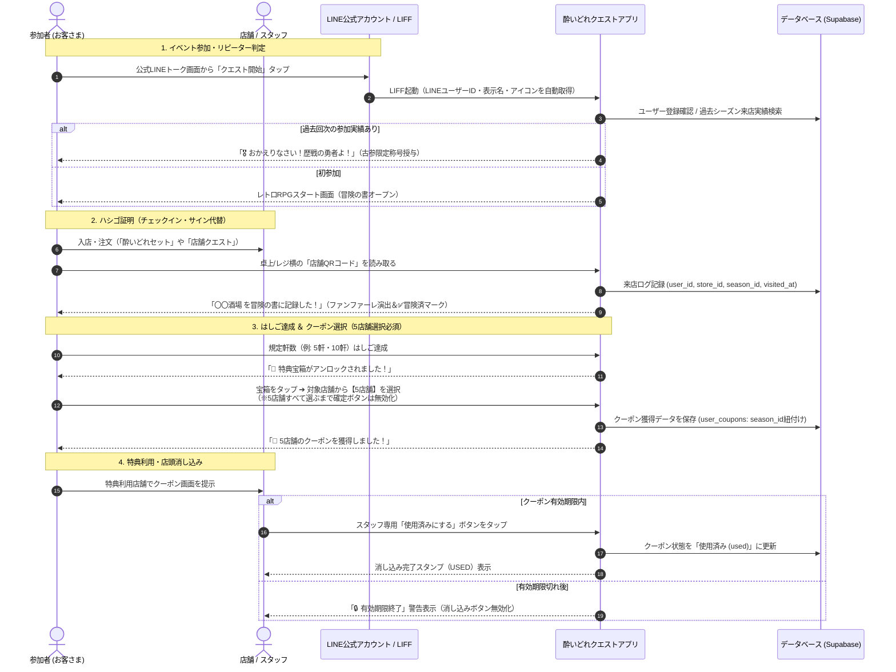
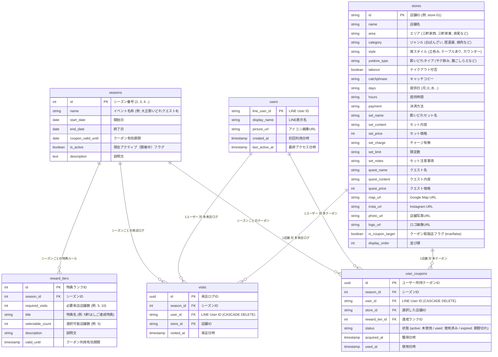

# 大正酔いどれクエスト - システム基本設計・機能仕様書

## 1. 概要と目的

### 1.1 プロジェクト概要
「大正酔いどれクエスト」は、大正区内の飲食店を巡る街ぶら・はしご酒イベント「大正酔いどれクエスト」の公式ガイド＆参加型クエストWebアプリです。

第1回イベントで好評だった「冒険の書（紙）」に店主が手書きサインを書くという**アナログな交流体験**を維持しながら、第2回以降では**LINE公式アカウントと連動したデジタル機能（来店証明・QRチェックイン・クーポン選択・店頭消し込み）**を導入し、参加者の利便性向上とリピート促進・周遊促進を実現します。

### 1.2 主な目的
1. **LINE公式アカウントの友達獲得とエンゲージメント強化**: 参加導線をLINE公式アカウントに一本化。過去回次の友だち全員をそのまま引き継ぎ可能。
2. **スマートなはしご（来店証明・サイン代替）記録**: 各店舗に設置されたQRコードを読み取るだけで、店舗スタッフやお客さんに負担をかけずにのべ来店数を記録。
3. **達成度に応じたクーポン選択機能**: はしご達成店舗数（例: 5軒、10軒達成）に応じて、対象店舗の中からお客さん自身が行きたい店舗のクーポンを選択・獲得。
4. **誤操作・権利未行使を防ぐバリデーション**: 規定枚数（例: 5店舗）すべてを選択するまで確定ボタンを押せない設計とし、選択途中で権利が失われるトラブルを完全防止。
5. **現場に即した柔軟なクーポン運用**: 事前に店舗特典内容を固定せず、当日の仕入れや状況に合わせて店舗が柔軟におもてなしできるチケット制を採用。
6. **確実なクーポン消し込み**: 特典利用時に店舗スタッフがスマホ画面上で消し込み操作を実行し、二重利用を防止。
7. **安全な並行運用アーキテクチャ**: 9月末まで稼働している現行イベント・クーポンを一切阻害せず、同じLINEプロバイダー内で完全に共存・切り替え可能な設計。
8. **シーズン制（回次管理）アーキテクチャ**: 第2回、第3回、第4回…とソースコードの再構築なしにバックオフィスからワンクリックで開催回を切り替えられる設計。
9. **バックオフィスデータ管理（完全リセット・削除・状態復元）**: 管理画面からユーザー、来店ログ、クーポンを個別・一括で安全に削除・状態変更できる運用設計。

---

## 2. システム構成・アーキテクチャ

```mermaid
flowchart TD
    subgraph LINE [LINE プラットフォーム (プロバイダー: 大正酔いどれ)]
        LineOA[大正酔いどれ公式<br/>(Messaging API / 既存友だち)]
        CurrentLIFF[現行クーポンLIFF<br/>(9月末まで通常稼働)]
        LIFF[大正酔いどれクエストⅡ LIFF<br/>(LIFF ID: 2011637649-WWv6pnTL)]
    end

    subgraph Client [クライアント (Webアプリ / GitHub Pages)]
        App[レトロRPG風 Webアプリ<br/>HTML5 / CSS3 / JavaScript]
        QRScanner[店頭QRコード読み取り<br/>①通常スマホカメラ / ②アプリ内スキャナー]
        CouponUI[冒険の書 / クーポン選択 / 消し込みUI]
        NoticeBanner[開催・クーポン期限動的バナー]
    end

    subgraph Backend [バックエンド (Supabase BaaS / Single Source of Truth)]
        Auth[LINE UID 認証・ユーザー管理]
        DB[(PostgreSQL データベース<br/>seasons / stores / users / visits / user_coupons)]
        Storage[(店舗ロゴ / 写真画像)]
    end

    subgraph Admin [バックオフィス運営管理システム (admin.html)]
        Dashboard[KPIダッシュボード / ランキング]
        StoreManage[店舗マスターCRUD / 特典対象ON/OFF]
        SeasonManage[シーズン作成・アクティブ切替]
        DataManage[ユーザー・来店ログ・クーポン削除 & 状態復元]
        POPGen[全店舗A4卓上POP一括印刷・QR生成]
    end

    LineOA -->|トーク画面・リッチメニューから起動| LIFF
    LIFF -->|LINE UID / プロフィール連携| App
    App -->|リアルタイムデータ送受信| Backend
    QRScanner -->|店舗チェックイン (?checkin=store-XX)| App
    NoticeBanner -->|フェーズ状態判定| App
    Admin -->|運営・削除・設定変更| DB
```

---

## 3. ユーザー体験（UX）フロー



---

## 4. データベース設計 (Supabase / PostgreSQL)



---

## 5. 実装機能一覧

| モジュール | 機能名 | 詳細・運用仕様 |
| :--- | :--- | :--- |
| **ユーザーアプリ** | **アプリ内蔵カメラQRリーダー** | ボトムナビ中央の「📷 QR読取」および「冒険の書」から即座にWebカメラを起動し、卓上POPのQRコードを高速スキャン。 |
| **ユーザーアプリ** | **外部カメラ直接チェックイン** | スマホ標準カメラやLINE QRリーダーからの読み取り時も、自動ログイン後にシームレスにチェックイン実行。 |
| **ユーザーアプリ** | **RPG風達成演出モーダル** | チェックイン成功時にファンファーレとともに「店舗名」「制覇数」「宝箱アンロック通知」をリッチに表示。 |
| **ユーザーアプリ** | **1シーズン1店舗1回制限** | 同一店舗への重複スキャン時は「すでに冒険済みです」と案内し、二重カウントを確実に防止。 |
| **ユーザーアプリ** | **開催フェーズ動的バナー** | 開催中・後夜祭（クーポン期間）・期間終了の3状態を自動検知してヘッダーにリアルタイム告知。 |
| **ユーザーアプリ** | **リピーター自動判定** | 過去シーズンの来店実績を検出し「🎖️ 歴戦の古参勇者」の限定称号と初回歓迎モーダルを表示。 |
| **ユーザーアプリ** | **クーポン5店舗完全選択** | 規定数すべてを選択するまで確定ボタンをロックし、誤操作による権利消失を防止。 |
| **ユーザーアプリ** | **期限切れ安全ガード** | 有効期限終了後は「使用済みにする」操作を自動無効化。 |
| **バックオフィス** | **はしご達成特典・宝箱設定** | 各シーズンごとの達成条件（必要来店数: 5軒/10軒など）や獲得可能クーポン数（5店舗）を完全GUIで新規作成・編集・削除。 |
| **バックオフィス** | **勇者レベル＆称号マスタ管理** | 制覇店舗数（0軒〜、1軒〜、3軒〜、5軒〜、10軒〜…）に応じたレベル・称号名・バッジカラー・説明文を自由に追加・編集・削除。 |
| **バックオフィス** | **シーズン制（回次）管理** | 第2回、第3回…の新規作成、開催日程設定、ワンクリックアクティブ切り替え。 |
| **バックオフィス** | **ユーザー完全削除** | ユーザーと紐づく来店履歴・獲得クーポンをカスケードで完全削除（テストデータ消去・初期化対応）。 |
| **バックオフィス** | **来店ログ個別削除** | 誤スキャンやテスト来店記録の個別取り消し。 |
| **バックオフィス** | **クーポン削除・状態切替** | クーポンデータの削除、および誤消し込み時の「未使用に戻す」ワンタップ復元。 |
| **バックオフィス** | **店舗マスター管理** | 33店舗の情報編集、新規追加、クーポン対象フラグの即時切替。 |
| **バックオフィス** | **全店舗POP一括印刷** | 全33店舗の卓上QRコードPOP（A4レイアウト）を即座に印刷・PDF出力。 |
| **バックオフィス** | **CSVエクスポート** | 参加者一覧、来店履歴、クーポン利用状況をExcel互換形式（UTF-8 BOM）で出力。 |

