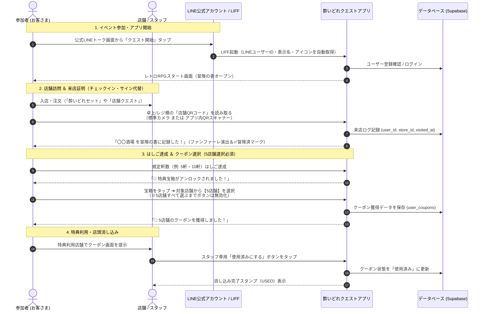
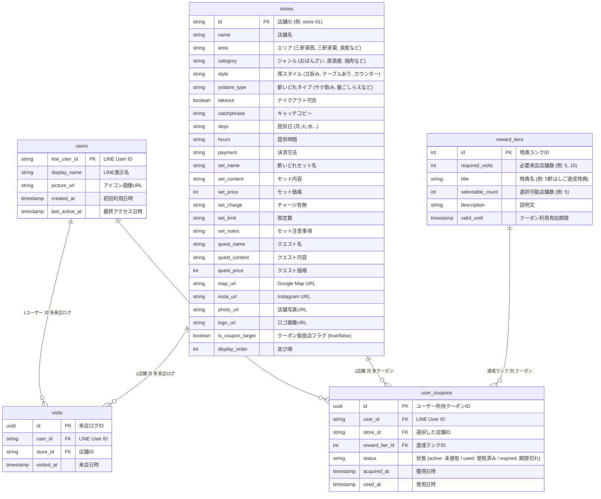

# 大正酔いどれクエストⅡ - システム基本設計・機能仕様書

## 1. 概要と目的

### 1.1 プロジェクト概要
「大正酔いどれクエストⅡ」は、大正区内の飲食店を巡る街ぶら・はしご酒イベント「大正酔いどれクエスト」の公式ガイド＆参加型クエストWebアプリです。

第1回イベントで好評だった「冒険の書（紙）」に店主が手書きサインを書くという**アナログな交流体験**を維持しながら、第2回では**LINE公式アカウントと連動したデジタル機能（来店証明・QRチェックイン・クーポン選択・店頭消し込み）**を導入し、参加者の利便性向上とリピート促進・周遊促進を実現します。

### 1.2 主な目的
1. **LINE公式アカウントの友達獲得とエンゲージメント強化**: 参加導線をLINE公式アカウントに一本化。既存の友だち全員をそのまま引き継ぎ可能。
2. **スマートなはしご（来店証明・サイン代替）記録**: 各店舗に設置されたQRコードを読み取るだけで、店舗スタッフやお客さんに負担をかけずにのべ来店数を記録。
3. **達成度に応じたクーポン選択機能**: はしご達成店舗数（例: 5軒、10軒達成）に応じて、対象店舗の中からお客さん自身が行きたい店舗のクーポンを選択・獲得。
4. **誤操作・権利未行使を防ぐバリデーション**: 規定枚数（例: 5店舗）すべてを選択するまで確定ボタンを押せない設計とし、選択途中で権利が失われるトラブルを完全防止。
5. **現場に即した柔軟なクーポン運用**: 事前に店舗特典内容を固定せず、当日の仕入れや状況に合わせて店舗が柔軟におもてなしできるチケット制を採用。
6. **確実なクーポン消し込み**: 特典利用時に店舗スタッフがスマホ画面上で消し込み操作を実行し、二重利用を防止。
7. **安全な並行運用アーキテクチャ**: 9月末まで稼働している現行イベント・クーポンを一切阻害せず、同じLINEプロバイダー内で完全に共存・切り替え可能な設計。

---

## 2. システム構成・アーキテクチャ

```mermaid
flowchart TD
    subgraph LINE [LINE プラットフォーム (プロバイダー: 大正酔いどれ)]
        LineOA[大正酔いどれ公式<br/>(Messaging API / 既存友だち)]
        CurrentLIFF[現行クーポンLIFF<br/>(9月末まで通常稼働)]
        LIFF[大正酔いどれクエストⅡ LIFF<br/>(LIFF ID: 2011637649-WWv6pnTL)]
    end

    subgraph Client [クライアント (Webアプリ / GitHub Pages)]
        App[レトロRPG風 Webアプリ<br/>HTML5 / CSS3 / JavaScript]
        QRScanner[店頭QRコード読み取り<br/>①通常スマホカメラ / ②アプリ内スキャナー]
        CouponUI[冒険の書 / クーポン選択 / 消し込みUI]
    end

    subgraph Backend [バックエンド (Supabase BaaS / Single Source of Truth)]
        Auth[LINE UID 認証・ユーザー管理]
        DB[(PostgreSQL データベース<br/>stores / users / visits / user_coupons)]
        Storage[(店舗ロゴ / 写真画像)]
    end

    subgraph Admin [管理者・店舗スタッフ]
        StoreQR[店頭設置用 POP QRコード<br/>(一括生成ツール)]
        ShopStaff[各店舗スタッフ<br/>(店頭消し込み操作 / デジタルサイン)]
        BackOffice[バックオフィス管理画面<br/>(店舗編集・統計)]
    end

    LineOA -->|トーク画面・リッチメニューから起動| LIFF
    LIFF -->|LINE UID / プロフィール連携| App
    App -->|リアルタイムデータ送受信| Backend
    QRScanner -->|店舗チェックイン (?checkin=store-XX)| App
    StoreQR -->|スキャン| QRScanner
    ShopStaff -->|画面上のボタンタップ| CouponUI
    BackOffice -->|店舗情報・有効期限設定| DB
```

---

## 3. ユーザー体験（UX）フロー



---

## 4. 機能要件詳細

### 4.1 LINE連携・認証機能 (LIFF)
- **LIFF SDK 連携**:
  - アプリ起動時に `liff.init()` を実行し、ユーザーの `LINE User ID`、`DisplayName`、`PictureUrl` を自動取得。
  - プロバイダー「大正酔いどれ」配下に新規チャネル（LIFF ID: `2011637649-WWv6pnTL`）を登録し、既存のLINE公式アカウントの友だち情報を100%引き継ぎ。
  - **ローカル開発用モック**: ローカル（`file:///` や `localhost`）実行時は自動的に開発用モック勇者（タロウ）に切り替わり、開発・検証を快適に実施可能。

### 4.2 QRコード来店チェックイン機能（デジタルサイン / 来店証明）
- **店舗固有URLの生成**:
  - 各店舗ごとに専用パラメータを付与したURL（例: `https://liff.line.me/2011637649-WWv6pnTL?checkin=store-01`）を発行。
  - このURLを埋め込んだQRコードを卓上POPやレジ横に設置。
- **2通りの読み取り導線**:
  1. **アプリ未起動時（スマホ標準カメラ）**: スマホの通常カメラで店頭QRをかざすと、LINEが自動起動し即座に対象店舗へのチェックイン処理が完了。
  2. **アプリ起動中（アプリ内QRスキャナー）**: アプリ内の「📷 QR読取」ボタンからカメラを起動して読み取り、画面遷移なしで即時チェックイン完了。
- **重複防止＆演出**:
  - 同一店舗への複数回チェックインは「この酒場はすでに冒険の書に記録済みです！」と表示し、重複カウントを防止。
  - 新規チェックイン時はファンファーレ効果音と「〇〇酒場を冒険の書に記録した！」のRPGメッセージで演出。

### 4.3 冒険の書（ステータス・進捗・称号）
- **動的レベル・称号システム**:
  - 訪問店舗数に応じてリアルタイムにレベルアップ＆称号が進化。
    - 0軒: Lv.1「駆け出しの呑兵衛」
    - 1〜2軒: Lv.2「見習い巡回兵」
    - 3〜4軒: Lv.3「ほろ酔い冒険者」
    - 5〜9軒: Lv.4「酒場制覇の豪傑」
    - 10軒以上: Lv.5「大正の伝説マスター」
- **進捗バー**: 全店舗（33店舗）中の制覇状況をプログレスバーで可視化。
- **訪問済み酒場タイムライン**: チェックインした店舗の一覧・日時表示。

### 4.4 クーポン選択・獲得機能（★重要バリデーション仕様）
- **現場に即したチケット仕様**:
  - 店舗ごとの固定メニューではなく、**「🎁 酔いどれ勇者の酒場特典（来店時に提示・本日の内容は各店舗にてご案内）」** という汎用チケットUIを採用。
- **完全選択必須バリデーション**:
  - 特典で獲得可能な規定枚数（例: 5店舗）**すべてにチェックが入るまで確定ボタンを無効化（グレーアウト）**。
  - 「あと X 店舗選択してください (計5店舗)」とカウントダウンを表示し、途中で確定して権利を失う誤操作を100%防止。
- **1店舗1枚制限**:
  - 同じ店舗のクーポンを重複して選ぶことは不可。
  - 既に獲得済みの店舗は「✅ 獲得済み」と表示されグレーアウト。
- **マイルストーン設定の柔軟性（設定ファイル化）**:
  - 設定ファイル（`js/config.js`）およびDBテーブル（`reward_tiers`）で達成条件や選択枚数を自由に定義可能。

### 4.5 クーポン利用・店舗スタッフ消し込み機能
- **誤操作防止の店頭確認UI**:
  - お客さんが所持クーポン一覧からチケットをタップして提示画面を開く。
  - 「【店舗スタッフ確認】使用済みにする」ボタンをスタッフが操作。
  - ステータスが「使用済み（USED）」に切り替わり、大きな **「USED / 利用済み」** スタンプと利用日時を表示。
  - 使用済みクーポンは再利用不可。

### 4.6 クーポン有効期限の管理仕様
- クーポンには利用可能期限（例: イベント期間中、またはイベント終了後の後夜祭期間、年内有効など）を設定可能。
- 期限が過ぎたクーポンは自動的に「期限切れ」表示となり、消し込みボタンが無効化される。

---

## 5. データベース設計 (Supabase / PostgreSQL)



---

## 6. 実装・検証ロードマップ

| ステップ | 作業内容 | 状況 |
| :--- | :--- | :---: |
| **Step 1: アプリUI & クーポン仕様実装** | ・レトロRPG風UI、案内所、店舗一覧・詳細<br>・冒険の書、クーポン5店舗完全選択バリデーション<br>・消し込み機能＆USEDスタンプ表示 | **✅ 完了** |
| **Step 2: データベース（Supabase）直結化** | ・Supabase テーブル構築＆店舗マスターデータ移行<br>・Excel依存の完全撤去（Single Source of Truth）<br>・エリア/カテゴリ/スタイルの動的生成 | **✅ 完了** |
| **Step 3: LINE LIFF 本番環境連携** | ・プロバイダー「大正酔いどれ」配下に新規LIFF（2011637649-WWv6pnTL）登録<br>・現行（9月末まで）システムとの安全な共存＆友だち引き継ぎ確立<br>・スマホ実機でのLINE認証・動作検証完了 | **✅ 完了** |
| **Step 4: 店頭QRコード一括生成 ＆ アプリ内スキャナー** | ・33店舗の卓上POP印刷用QRコード生成ツール<br>・アプリ内カメラQRリーダー機能の実装 | **進行中** |
| **Step 5: バックオフィス・運用ダッシュボード** | ・店舗情報の管理画面編集機能<br>・クーポン有効期限・マイルストーン設定<br>・参加者数・はしご統計の可視化 | **次フェーズ** |
