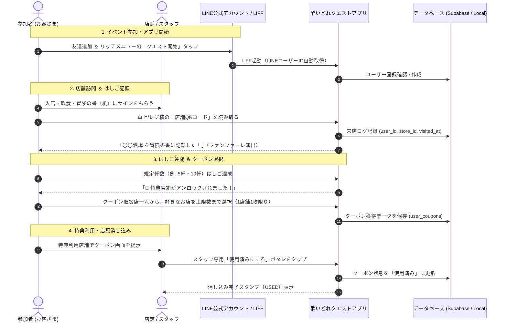
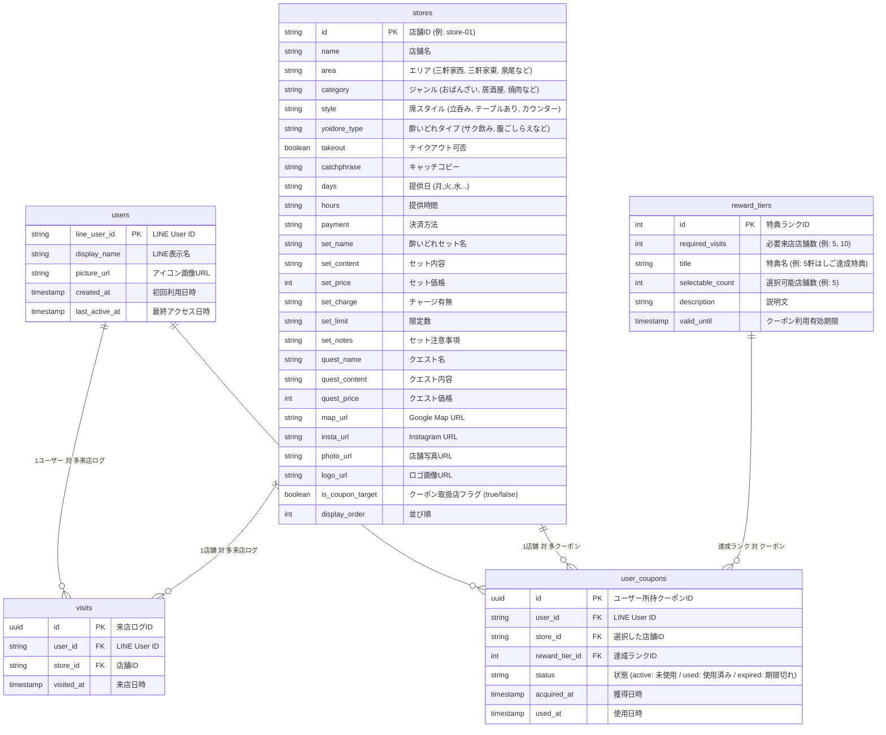

# 大正酔いどれクエストⅡ - システム基本設計・機能仕様書

## 1. 概要と目的

### 1.1 プロジェクト概要
「大正酔いどれクエストⅡ」は、大正区内の飲食店を巡る街ぶら・はしご酒イベント「大正酔いどれクエスト」の公式ガイド＆参加型クエストWebアプリです。

第1回イベントで好評だった「冒険の書（紙）」に店主が手書きサインを書くという**アナログな交流体験**を維持しながら、第2回では**LINE公式アカウントと連動したデジタル機能（来店記録・クーポン選択・消し込み）**を導入し、参加者の利便性向上とリピート促進・周遊促進を実現します。

### 1.2 主な目的
1. **LINE公式アカウントの友達獲得とエンゲージメント強化**: 参加導線をLINE公式アカウントに一本化。
2. **スマートなはしご（来店）記録**: 各店舗に設置されたQRコードを読み取るだけで、店舗スタッフやお客さんに負担をかけずにのべ来店数を記録。
3. **達成度に応じたクーポン選択機能**: はしご達成店舗数（例: 5軒、10軒達成）に応じて、対象店舗の中からお客さん自身が行きたい店舗のクーポンを選択・獲得。
4. **現場に即した柔軟なクーポン運用**: 事前に店舗特典内容を固定せず、当日の仕入れや状況に合わせて店舗が柔軟におもてなしできるチケット制を採用。
5. **確実なクーポン消し込み**: 特典利用時に店舗スタッフがスマホ画面上で消し込み操作を実行し、二重利用を防止。
6. **ハイブリッド実行アーキテクチャ**: ローカル（オフライン・Excel直読）での快適な検証と、クラウド（Supabase＋LINE LIFF）での本番運用の両立。

---

## 2. システム構成・アーキテクチャ

```mermaid
flowchart TD
    subgraph LINE [LINE プラットフォーム]
        LineOA[LINE公式アカウント<br/>リッチメニュー]
        LIFF[LINE Front-end Framework<br/>(LIFF SDK)]
    end

    subgraph Client [クライアント (Webアプリ / Standalone)]
        App[レトロRPG風 Webアプリ<br/>HTML5 / CSS3 / JavaScript]
        QRScanner[QRコード読み取り / URLパラメータ検知]
        CouponUI[冒険の書 / クーポン選択 / 消し込みUI]
        LocalStorage[(ローカルストレージ<br/>オフライン/テスト用フォールバック)]
    end

    subgraph Backend [バックエンド (Supabase BaaS)]
        Auth[LINE UID 認証・ユーザー管理]
        DB[(PostgreSQL データベース)]
        Storage[(店舗ロゴ / 画像)]
    end

    subgraph Admin [管理者・バックオフィス]
        Excel[店舗管理 Excel / CSV<br/>(STORES.xlsx)]
        Config[設定ファイル<br/>(js/config.js)]
        TableEditor[Supabase Table Editor<br/>(スプレッドシート風管理画面)]
        ShopStaff[各店舗スタッフ<br/>(店頭消し込み操作)]
    end

    LineOA -->|タップして起動| LIFF
    LIFF -->|LINE UID / プロフィール連携| App
    App -->|データ取得 / 来店記録 / クーポン発行| Backend
    App -.->|オフライン時 / ローカル実行時| LocalStorage
    QRScanner -->|店舗QRコード読み取り| App
    Excel -->|データ一括インポート| DB
    Excel -->|データ変換バッチ| App
    Config -->|達成条件・マイルストーン設定| App
    ShopStaff -->|画面上のボタンタップ| CouponUI
```

---

## 3. ユーザー体験（UX）フロー



---

## 4. 機能要件詳細

### 4.1 LINE連携・認証機能 (LIFF)
- **LIFF SDK 連携**:
  - アプリ起動時に `liff.init()` を実行し、ユーザーの `LINE User ID`、`DisplayName`、`PictureUrl` を自動取得。
  - LINEアプリ外（ブラウザ）で直接開かれた場合でも、LINEログイン画面へリダイレクトして確実にLINE UIDを取得。
  - **ローカル開発用モック**: ローカル（`file:///`）実行時は自動的に開発用モック勇者（タロウ）に切り替わり、LINE環境がなくても全機能をテスト可能。

### 4.2 QRコード来店チェックイン機能
- **店舗固有URLの生成**:
  - 各店舗ごとに専用パラメータを付与したURL（例: `https://taishoyoidore-ui.github.io/yoidore-quest2/?checkin=store-01`）を発行。
  - このURLを埋め込んだQRコードを卓上POPやレジ横に設置。
- **チェックイン処理**:
  - お客さんがスマホ標準カメラやLINEのQRリーダーで読み取ると、アプリが自動起動。
  - すでにチェックイン済みの店舗の場合は「この酒場はすでに冒険の書に記録済みです！」と表示（同一店舗の重複カウント防止）。
  - 新規チェックイン時は、RPG風メッセージ「〇〇酒場を冒険の書に記録した！」とファンファーレ効果音で演出。

### 4.3 冒険の書（はしご状況・ステータス管理）
- **勇者ステータス**: LINEアイコン、ユーザー名、制覇数に応じた称号（見習い巡回兵 ➔ ほろ酔い冒険者 ➔ 酒場制覇の豪傑 ➔ 大正の伝説マスター）とLv表示。
- **進捗バー**: 全店舗中の制覇割合をプログレスバーで可視化。
- **訪問済み酒場タイムライン**: 制覇した店舗と訪問日時の一覧表示。

### 4.4 クーポン選択・獲得機能（★重要仕様）
- **現場に即したチケット仕様**:
  - 事前に店舗ごとの固定特典テキストを登録するのではなく、**「🎁 酔いどれ勇者の酒場特典（来店時に提示・本日の内容は各店舗にてご案内）」** という汎用チケットUIに統一。
  - お店側は仕入れや状況に合わせて「本日はワンドリンクサービス」「本日は小鉢サービス」など柔軟に運用可能。
- **選択ルール**:
  - **1店舗につき1枚限り**: 同じ店舗のクーポンを重複して複数枚選ぶことは不可。
  - **取得済み店舗の制御**: すでに獲得済みの店舗は選択モーダルで「✅ 獲得済み」となり選択不可（グレーアウト）。
  - **クーポン取扱店フラグ**: 店舗マスタで「クーポン取扱店（`is_coupon_target = true`）」と設定されている店舗のみを選択リストに表示。
- **マイルストーン設定の柔軟性（設定ファイル化）**:
  - 「何軒達成で何枚選べるか」は設定ファイル（`js/config.js`）およびDBテーブル（`reward_tiers`）で定義。
  - 数値（`required_visits`: 必要訪問数, `selectable_count`: 選択可能枚数）を変更するだけで、プログラム本体を改修することなく即座にルール変更可能。

```javascript
// js/config.js の設定構造例
fallbackRewardTiers: [
  {
    id: 1,
    required_visits: 5,   // 5軒はしごでアンロック
    title: '5軒はしご達成特典',
    selectable_count: 5,  // 5店舗選べる
    description: 'クーポン取扱店の中からお好きな5店舗を選んで特典チケットを獲得！'
  },
  {
    id: 2,
    required_visits: 10,  // 10軒はしごでアンロック
    title: '10軒はしご達成特典',
    selectable_count: 5,  // さらに5店舗選べる
    description: 'クーポン取扱店の中からさらにお好きな5店舗を選んで特典チケットを獲得！'
  }
]
```

### 4.5 クーポン利用・店舗スタッフ消し込み機能
- **誤操作防止の店頭確認UI**:
  - お客さんが所持クーポン一覧からチケットをタップして提示画面を開く。
  - 「【店舗スタッフ確認】使用済みにする」ボタンをタップすると、確認ダイアログが表示。
  - スタッフが操作を完了すると、ステータスが「使用済み（USED）」に切り替わり、画面に大きな **「USED / 利用済み」** スタンプと利用日時が表示される。
  - 使用済みクーポンは再利用不可。

### 4.6 クーポン有効期限の管理仕様（バックオフィス対応）
- クーポンには利用可能期限（例: イベント期間中、またはイベント終了後の後夜祭期間、年内有効など）を設定可能。
- 期限が過ぎたクーポンは自動的に「期限切れ」表示となり、消し込みボタンが無効化される。

---

## 5. データベース設計 (Supabase / PostgreSQL)



---

## 6. バックオフィス・運用設計

### 6.1 店舗マスタ管理（Excel / CSVインポート）
1. 管理者は原本エクセル `STORES.xlsx` にて店舗情報を編集・管理：
   - 「クーポン対象」（`1` または `○` または 空白）
   - 店舗基本情報（営業時間、定休日、セット内容、クエスト内容など）
2. データ変換バッチ（Pythonスクリプト）または Supabase Table Editor の CSV インポート機能により、ローカルおよびクラウドDBへ一括反映。

### 6.2 クーポン有効期限・設定の更新
- イベント期間終了後の「後夜祭」開催期間などに合わせて、`valid_until`（有効期限）を管理画面または設定ファイルから一括更新可能。

### 6.3 店舗用QRコードの一括生成・配布
- 各店舗ID（`store-01` 〜 `store-XX`）に紐づくチェックインURL一覧から、QRコード画像を一括生成して卓上POPやステッカーを作成。

---

## 7. 実装・検証ロードマップ

| ステップ | 作業内容 | 状況 |
| :--- | :--- | :---: |
| **Step 1: ローカルUI & クーポン仕様実装** | ・レトロRPG風UI、案内所、店舗一覧・詳細<br>・冒険の書、クーポン選択（1店舗1枚・汎用チケット制）<br>・消し込み機能＆ローカルストレージ永続化 | **✅ 完了** |
| **Step 2: 仕様書（本ドキュメント）整備** | ・システム仕様、クーポンルール、DB設計の明文化 | **✅ 完了** |
| **Step 3: Web公開 & バックエンド連携** | ・GitHub Pages へのデプロイ<br>・Supabase データベースへのテーブル構築＆店舗データ投入<br>・LINE Developers (LIFF) 本番登録 | **次フェーズ** |
| **Step 4: バックオフィス・運用環境整備** | ・Excelからのデータ更新フロー確立<br>・有効期限設定・店舗QRコード一括生成スクリプト | **次フェーズ** |
| **Step 5: 実機・総合テスト** | ・スマホ実機（LINEアプリ内）でのQR読取・消し込み検証<br>・本番稼働 | **最終フェーズ** |
