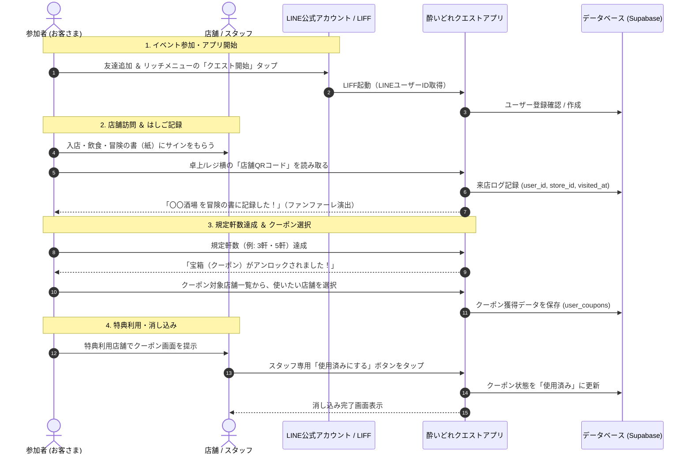
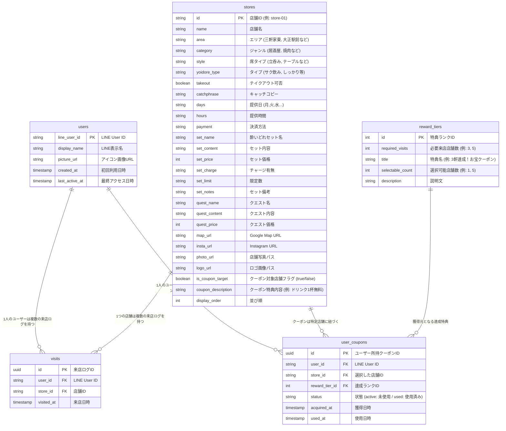

# 大正酔いどれクエストⅡ - システム基本設計・機能仕様書

## 1. 概要と目的

### 1.1 プロジェクト概要
「大正酔いどれクエストⅡ」は、大正区内の飲食店（約60店舗）を巡る街ブライベント「大正街ぶらイベント」の公式ガイド＆参加型クエストWebアプリです。

第1回イベントで好評だった「冒険の書（紙）」に店主が手書きサインを書くという**アナログな交流体験**を維持しながら、第2回では**LINE公式アカウントと連動したデジタル機能（来店記録・クーポン選択・消し込み）**を導入し、参加者の利便性向上とリピート促進・周遊促進を実現します。

### 1.2 主な目的
1. **LINE公式アカウントの友達獲得とエンゲージメント強化**: 参加導線をLINE公式アカウントに一本化。
2. **スマートなはしご（来店）記録**: 各店舗に設置されたQRコードを読み取るだけで、店舗スタッフやお客さんに負担をかけずにのべ来店数を記録。
3. **達成度に応じたクーポン選択機能**: 来店数（例: 3軒、5軒達成）に応じて、対象店舗の中からお客さん自身が行きたい店舗のクーポンを選択・獲得。
4. **確実なクーポン消し込み**: 特典利用時に店舗スタッフがスマホ画面上で消し込み操作を実行。
5. **Supabaseによる柔軟かつ低コストなデータ管理**: スプレッドシート感覚で閲覧・編集・Excelインポートが可能なクラウドデータベースを活用。

---

## 2. システム構成・アーキテクチャ

```mermaid
flowchart TD
    subgraph LINE [LINE プラットフォーム]
        LineOA[LINE公式アカウント<br/>リッチメニュー]
        LIFF[LINE Front-end Framework<br/>(LIFF SDK)]
    end

    subgraph Client [クライアント (Webアプリ)]
        App[レトロRPG風 Webアプリ<br/>HTML5 / CSS3 / JavaScript]
        QRScanner[QRコード読み取り / パラメータ検知]
        CouponUI[冒険の書 / クーポン選択 / 消し込みUI]
    end

    subgraph Backend [バックエンド (Supabase BaaS)]
        Auth[LINE UID 認証・ユーザー管理]
        DB[(PostgreSQL データベース)]
        Storage[(店舗ロゴ / 画像)]
    end

    subgraph Admin [管理者・店舗運用]
        Excel[店舗管理 Excel / CSV]
        TableEditor[Supabase Table Editor<br/>(スプレッドシート風管理画面)]
        ShopStaff[各店舗スタッフ<br/>(消し込み操作 / サイン記入)]
    end

    LineOA -->|タップして起動| LIFF
    LIFF -->|LINE UID / プロフィール連携| App
    App -->|データ取得 / 来店記録 / クーポン発行| Backend
    QRScanner -->|店舗QRコード読み取り| App
    Excel -->|CSVインポート| TableEditor
    TableEditor --> DB
    ShopStaff -->|画面上のボタンタップ| CouponUI
```

---

## 3. ユーザー体験（UX）フロー



---

## 4. 機能要件詳細

### 4.1 LINE連携・認証機能 (LIFF)
- LINE Front-end Framework (LIFF) を導入。
- アプリ起動時に `liff.init()` を実行し、ユーザーの `LINE User ID`、`DisplayName`、`PictureUrl` を自動取得。
- LINEアプリ外（Safari/Chrome等）で直接開かれた場合でも、LINEログイン画面へリダイレクトして確実にLINE UIDを取得。
- ユーザー登録画面などの入力フォームを不要にし、離脱を防止。

### 4.2 QRコード来店チェックイン機能（約60店舗対応）
- **店舗固有URLの生成**:
  - 各店舗ごとに専用パラメータを付与したURL（例: `https://liff.line.me/{liff_id}?action=checkin&store_id=store-01`）を発行。
  - このURLを埋め込んだQRコードを印刷し、卓上POPやレジ横に設置。
- **チェックイン処理**:
  - お客さんがスマホ標準カメラやLINEのQRリーダーで読み取ると、アプリが自動起動。
  - すでにチェックイン済みの店舗の場合は「本日すでにチェックイン済みです」と表示（同日同一店舗の重複カウント防止）。
  - 新規チェックイン時は、RPG風メッセージ「〇〇酒場を制覇した！」と効果音で演出。

### 4.3 冒険の書（はしご状況・ステータス管理）
- **現在のはしご軒数表示**: 「現在 4 / 60 軒制覇！」
- **訪れた店舗リスト**: 制覇した店舗にチェックマークやスタンプが押される一覧表示。
- **進捗ゲージ**: 次の特典（例: 3軒達成、5軒達成）までの残り軒数を視覚的に表示。

### 4.4 クーポン選択・獲得機能（★重要要件）
- **達成段階ごとのアンロック**:
  - 例: 
    - 3軒達成時：クーポン対象店舗の中から **1店舗** を選択可能
    - 5軒達成時：クーポン対象店舗の中から **指定店舗数（例: 5店舗）** を選択可能
- **対象店舗の選択UI**:
  - マスタで「クーポン対象（`is_coupon_target = true`）」と設定されている店舗のみを一覧表示。
  - ユーザーが店舗一覧からチェックボックス等で行きたい店舗を選択し、「この店舗のクーポンを獲得する」ボタンで確定。
  - 選択後は「獲得済みクーポン一覧」に保存される。

### 4.5 クーポン利用・店舗スタッフ消し込み機能
- **誤操作防止の2段階UI**:
  - お客さんがクーポン画面を開き、店舗スタッフに提示。
  - 「【店舗スタッフ専用】利用済みにする」ボタンをタップすると確認ダイアログ（または誤タップ防止スライダー）が表示。
  - スタッフが操作を完了すると、ステータスが「使用済み（USED）」に切り替わり、利用日時が記録される。
  - 使用済みクーポンは再利用不可（グレーアウト表示）。

### 4.6 現行アプリ機能の統合・継承
- **レトロRPGデザイン**: CRTスキャンライン、ドット絵UI、8bit風サウンド演出を完全維持。
- **店舗検索・絞り込み**: エリア別、ジャンル別、提供日・提供時間別の絞り込み。
- **店舗詳細表示**: 酔いどれセット内容、クエスト内容、Google Maps連携、Instagram連携。

---

## 5. データベース設計 (Supabase / PostgreSQL)

### 5.1 テーブル定義



---

## 6. 管理・運用フロー

### 6.1 店舗マスタ管理（Excel / CSVインポート）
1. 管理者は既存の `STORES.xlsx` に以下の列を追加・編集：
   - `クーポン対象`（〇 または 空欄）
   - `クーポン内容`（例: 「小鉢1品サービス」「ドリンク1杯半額」等）
2. ExcelをCSV形式で保存。
3. Supabase管理画面の `stores` テーブルから「Insert」→「Import data from CSV」で一括取り込み。
4. プログラム修正なしで、即座に全ユーザーのアプリ画面に反映。

### 6.2 60店舗分のQRコード生成・配布
1. 各店舗ID（`store-01` 〜 `store-60`）に対応したチェックインURL一覧を生成。
2. 一括QRコード生成スクリプト（Python等）を用いて、店舗名入りのQRコード画像を一括出力。
3. 各店舗へPOPまたはステッカーとして配布し、卓上やレジ前に設置。

### 6.3 クーポン消し込みの現場オペレーション
1. お客さんが「クーポン画面」を店員に見せる。
2. 店員が画面内の「【店員専用】使用済みにする」ボタンをタップ。
3. 画面が「使用済み」に変化したことを確認し、特典（おつまみ・ドリンク等）を提供。

---

## 7. 実装・移行ロードマップ

| フェーズ | 作業内容 | 成果物・検証 |
| :--- | :--- | :--- |
| **Phase 1: DB・環境構築** | ・Supabaseプロジェクト作成<br>・テーブル定義SQL実行<br>・ExcelデータからのCSVインポート | Supabase上で店舗データ・クーポンデータが確認できる状態 |
| **Phase 2: LINE/LIFF連携** | ・LINE DevelopersでLIFFアプリ登録<br>・アプリ側LIFF SDK組み込み<br>・自動ログイン＆ユーザー登録処理 | LINEで開いた際にユーザーIDが取得できること |
| **Phase 3: QRチェックイン＆冒険の書** | ・QRコードURLのパラメータ解析処理<br>・来店ログ保存API連携<br>・冒険の書（来店履歴・進捗バー）UI実装 | QR読み取りで来店数が増加し、UIに反映されること |
| **Phase 4: クーポン選択＆消し込み** | ・達成判定ロジック実装<br>・対象店舗選択モーダルUI<br>・スタッフ消し込み操作＆更新処理 | 規定数達成で店舗を選択し、スタッフが消し込めること |
| **Phase 5: テスト・総合検証** | ・実機テスト（iOS/Android LINEアプリ）<br>・例外処理（オフライン、二重読み込み等）検証<br>・店舗用QRコード一括生成スクリプト作成 | 本番稼働準備完了 |
