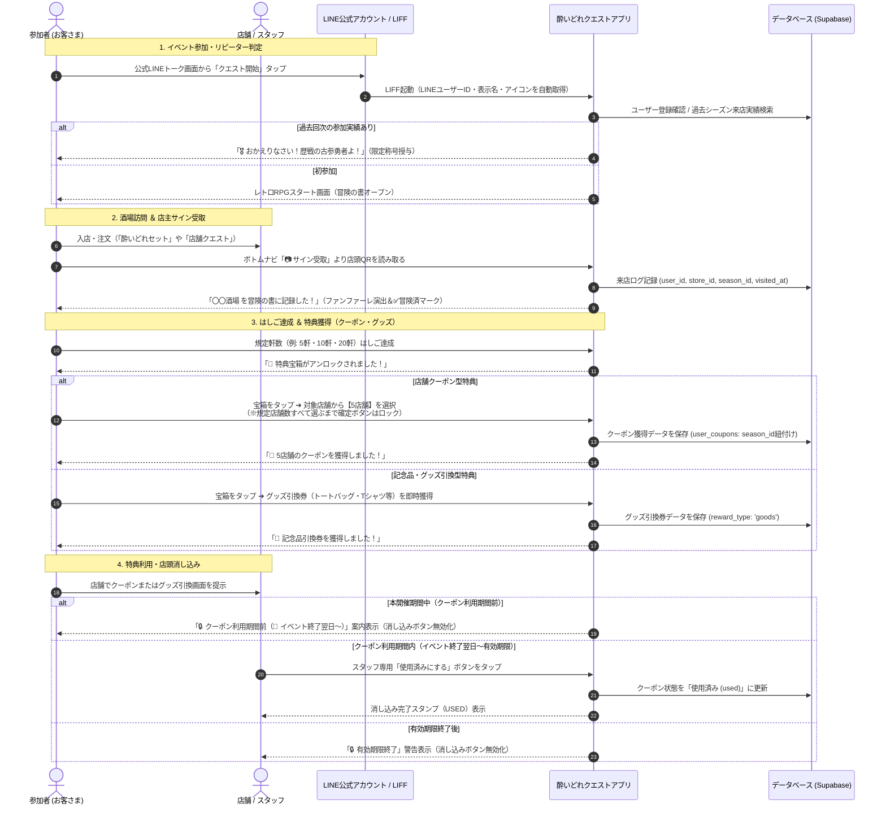
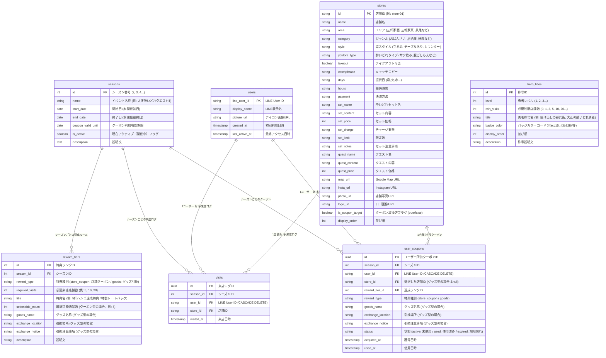
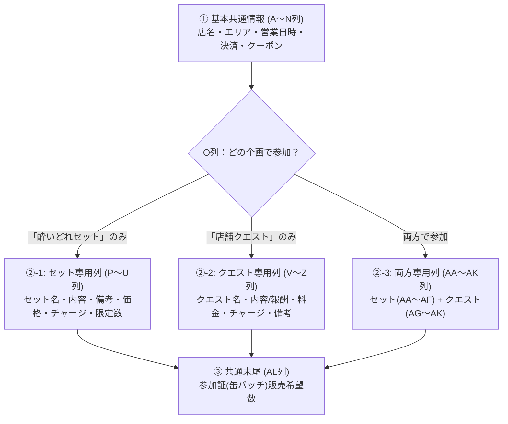

# 大正酔いどれクエスト - システム基本設計・機能仕様書

## 1. 概要と目的

### 1.1 プロジェクト概要
「大正酔いどれクエスト」は、大正区内の飲食店を巡る街ぶら・はしご酒イベント「大正酔いどれクエスト」の公式ガイド＆参加型クエストWebアプリです。

第1回イベントで好評だった「冒険の書（紙）」に店主が手書きサインを書くという**アナログな交流体験**を維持しながら、第2回以降では**LINE公式アカウントと連動したデジタル機能（店主サイン受取・酒場訪問記録・クーポン＆グッズ獲得・店頭消し込み）**を導入し、参加者の利便性向上とリピート促進・周遊促進を実現します。

### 1.2 主な目的
1. **LINE公式アカウントの友達獲得とエンゲージメント強化**: 参加導線をLINE公式アカウントに一本化。過去回次の友だち全員をそのまま引き継ぎ可能。
2. **スマートな酒場訪問（店主サイン受取）記録**: 各店舗に設置されたQRコードを読み取るだけで、店舗スタッフやお客さんに負担をかけずにのべ来店数を冒険の書に記録。
3. **達成度に応じた特典選択機能（クーポン＆グッズ）**: はしご達成店舗数（例: 5軒、10軒、20軒達成）に応じて、対象店舗クーポン（5店舗選択）や限定グッズ引換券（トートバッグ、Tシャツ等）を獲得。
4. **誤操作・権利未行使を防ぐバリデーション**: 店舗クーポン選択時、規定枚数（例: 5店舗）すべてを選択するまで確定ボタンを押せない設計とし、選択途中で権利が失われるトラブルを完全防止。
5. **フェーズに応じたクーポン利用制御**: 本開催中（サイン集め期間）はクーポンの消し込みをロックし、イベント終了翌日〜有効期限までの期間に店舗で使える運用を確立。
6. **確実な店頭消し込み**: 特典利用時に店舗スタッフがスマホ画面上で消し込み操作を実行し、二重利用を防止。
7. **安全な並行運用アーキテクチャ**: 9月末まで稼働している現行イベント・クーポンを一切阻害せず、同じLINEプロバイダー内で完全に共存・切り替え可能な設計。
8. **シーズン制（回次管理）アーキテクチャ**: 第2回、第3回、第4回…とソースコードの再構築なしにバックオフィスからワンクリックで開催回を切り替えられる設計。
9. **バックオフィスデータ管理（完全リセット・削除・状態復元）**: 管理画面からユーザー、来店ログ、クーポン、特典ランク、称号マスタを個別・一括で安全に登録・削除・状態変更できる運用設計。

---

## 2. システム構成・アーキテクチャ

```mermaid
flowchart TD
    subgraph LINE [LINE プラットフォーム (プロバイダー: 大正酔いどれ)]
        LineOA[大正酔いどれ公式<br/>(Messaging API / 既存友だち)]
        CurrentLIFF[現行クーポンLIFF<br/>(9月末まで通常稼働)]
        LIFF[大正酔いどれクエストⅡ LIFF<br/>(LIFF ID: 2011637649-WWv6pnTL)]
    end

    subgraph Client [クライアント (Webアプリ / GitHub Pages)]
        App[レトロRPG風 Webアプリ<br/>HTML5 / CSS3 / JavaScript]
        QRScanner[店頭QRコード読み取り<br/>①通常スマホカメラ / ②アプリ内スキャナー]
        CouponUI[冒険の書 / クーポン＆グッズ引換 / 店頭消し込みUI]
        NoticeBanner[開催・クーポン利用期限動的バナー]
    end

    subgraph Backend [バックエンド (Supabase BaaS / Single Source of Truth)]
        Auth[LINE UID 認証・ユーザー管理]
        DB[(PostgreSQL データベース<br/>seasons / stores / users / visits / user_coupons / reward_tiers / hero_titles)]
        Storage[(店舗ロゴ / 写真画像)]
    end

    subgraph Admin [バックオフィス運営管理システム (admin.html)]
        Dashboard[KPIダッシュボード / ランキング]
        StoreManage[店舗マスターCRUD / 特典対象ON/OFF]
        SeasonManage[シーズン作成・開催日程・アクティブ切替]
        TierManage[特典ランクCRUD (クーポン型/グッズ型)]
        TitleManage[勇者レベル・称号マスタ管理]
        DataManage[ユーザー・来店ログ・クーポン削除 & 状態復元]
        POPGen[全店舗A4卓上POP一括印刷・QR生成]
    end

    LineOA -->|トーク画面・リッチメニューから起動| LIFF
    LIFF -->|LINE UID / プロフィール連携| App
    App -->|リアルタイムデータ送受信| Backend
    QRScanner -->|店主サイン受取 (?checkin=store-XX)| App
    NoticeBanner -->|フェーズ状態判定| App
    Admin -->|運営・削除・設定変更| DB
```

---

## 3. ユーザー体験（UX）フロー



---

## 4. データベース設計 (Supabase / PostgreSQL)



---

## 5. 実装機能一覧

| モジュール | 機能名 | 詳細・運用仕様 |
| :--- | :--- | :--- |
| **ユーザーアプリ** | **アプリ内蔵カメラQRリーダー** | ボトムナビ中央の「📷 サイン受取」から即座にWebカメラを起動し、卓上POPのQRコードを高速スキャン。 |
| **ユーザーアプリ** | **外部カメラ直接サイン受取** | スマホ標準カメラやLINE QRリーダーからの読み取り時も、自動ログイン後にシームレスに来店記録を実行。 |
| **ユーザーアプリ** | **RPG風達成演出モーダル** | サイン受取成功時にファンファーレとともに「店舗名」「制覇数」「宝箱アンロック通知」をリッチに表示。 |
| **ユーザーアプリ** | **1シーズン1店舗1回制限** | 同一店舗への重複スキャン時は「すでに冒険の書に記録済みです」と案内し、二重カウントを確実に防止。 |
| **ユーザーアプリ** | **開催フェーズ動的バナー** | 本開催中・後夜祭（クーポン利用期間）・期間終了の3状態を自動検知してヘッダーにリアルタイム告知。 |
| **ユーザーアプリ** | **リピーター自動判定** | 過去シーズンの来店実績を検出し「🎖️ 歴戦の古参勇者」の限定称号と初回歓迎モーダルを表示。 |
| **ユーザーアプリ** | **クーポン規定数完全選択** | 規定数（例: 5店舗）すべてを選択するまで確定ボタンをロックし、誤操作による権利消失を防止。 |
| **ユーザーアプリ** | **クーポン利用期間制御** | 本開催期間中はクーポン消し込みをロックし「📅 イベント終了翌日〜利用可能」の旨を表示。後夜祭期間に消し込みボタンを有効化。 |
| **ユーザーアプリ** | **記念品・グッズ引換対応** | 店舗クーポンだけでなく、トートバッグやTシャツ等のグッズ引換券の発行・店舗/本部消し込みに対応。 |
| **ユーザーアプリ** | **テスト用サイン記録機能** | 開発・事前検証用として、+5店舗、+10店舗、+15店舗のサイン一括付与および履歴リセットボタンを搭載。 |
| **バックオフィス** | **特典ランク・宝箱管理** | 店舗クーポン型／グッズ引換型の2系統に対応し、必要来店数やグッズ引換情報を完全GUIで新規作成・編集・削除。 |
| **バックオフィス** | **勇者レベル＆称号マスタ管理** | 制覇店舗数（0軒〜、1軒〜、3軒〜、5軒〜、10軒〜…）に応じたレベル・称号名・バッジカラー・説明文を追加・編集・削除。 |
| **バックオフィス** | **シーズン制（回次）管理** | 第2回、第3回…の新規作成、開催日程・クーポン利用期限設定、ワンクリックアクティブ切り替え。 |
| **バックオフィス** | **ユーザー完全削除** | ユーザーと紐づく来店履歴・獲得クーポンをカスケードで完全削除（テストデータ消去・初期化対応）。 |
| **バックオフィス** | **来店ログ個別削除** | 誤スキャンやテスト来店記録の個別取り消し。 |
| **バックオフィス** | **クーポン削除・状態切替** | クーポンデータの削除、および誤消し込み時の「未使用に戻す」ワンタップ復元。 |
| **バックオフィス** | **店舗マスター管理** | 33店舗の情報編集、新規追加、クーポン対象フラグの即時切替。 |
| **バックオフィス** | **全店舗POP一括印刷** | 全33店舗の卓上QRコードPOP（A4レイアウト）を即座に印刷・PDF出力。 |
| **バックオフィス** | **CSVエクスポート** | 参加者一覧、来店履歴、クーポン利用状況をExcel互換形式（UTF-8 BOM）で出力。 |

---

## 6. 店舗マスター ＆ アンケートExcelインポート仕様

### 6.1 アンケートExcelの全体構造（3セクション・全38列）
店舗情報アンケート（Googleフォーム集計結果）は、企画参加形態に応じた**条件分岐（セクション分岐）**を持つ特殊なレイアウト構造となっています。



---

### 6.2 企画選択（O列）による条件分岐抽出仕様

* **【酔いどれセット情報の抽出元】**:
  * `O列` が `「酔いどれセット」のみで参加` ➔ **P〜U列** からセット名・内容・備考・価格・チャージ・限定数を抽出（クエスト項目は空・0・不要）
  * `O列` が `「酔いどれセット」・「店舗クエスト」両方で参加` ➔ **AA〜AF列** からセット名・内容・備考・価格・チャージ・限定数を抽出
  * `O列` が `「店舗クエスト」のみで参加` ➔ セット項目は空・0・不要
* **【店舗クエスト情報の抽出元】**:
  * `O列` が `「店舗クエスト」のみで参加` ➔ **V〜Z列** からクエスト名・内容/報酬・料金・チャージ・備考を抽出（セット項目は空・0・不要）
  * `O列` が `「酔いどれセット」・「店舗クエスト」両方で参加` ➔ **AG〜AK列** からクエスト名・内容/報酬・料金・チャージ・備考を抽出
  * `O列` が `「酔いどれセット」のみで参加` ➔ クエスト項目は空・0・不要

---

### 6.3 Excel列 ➔ データベース統一JSON ➔ UI 項目対照表

| Excel列（全38列） | データベース統一JSONキー | 型 | アプリ画面（ユーザー画面） | バックオフィス管理画面 |
|---|---|---|---|---|
| A: タイムスタンプ | *(取込判定用)* | string | - | - |
| B: 店名 | `name` | string | 酒場名タイトル | 酒場名（正式名称） |
| C: 参加意思 | *(取込判定用)* | string | （参加店舗のみ表示） | 取り込み対象判定 |
| D: エリア | `area` | string | エリアバッジ (三軒家西/東/駅前/泉尾/平尾) | エリア選択 |
| E: カテゴリ | `category` | string | カテゴリバッジ (居酒屋, おばんざい等) | ジャンル/カテゴリ |
| F: スタイル | `style` | string | 席スタイル情報 | 席スタイル |
| G: タイプ | `type` | string | 酔いどれタイプ (サク飲み/腹ごしらえ等) | 酔いどれタイプ |
| H: テイクアウト | `takeout` | string | テイクアウトバッジ (OK/不可/専門) | テイクアウト |
| I: 提供曜日 | `days` | string | 提供曜日 (`月,火,水,木,金,土`) | 提供曜日チェック |
| J: 提供時間：開始<br>K: 提供時間：終了 | `hours` | string | 提供時間 (`17:00〜22:00`) | 提供時間 |
| L: 提供時間に対する補足 | `time_notes` | string | **💡 提供時間補足バッジ** | **提供時間・補足** |
| M: 決済方法 | `payment` | string | 利用可能な決済方法 | 決済方法 |
| N: 店舗クーポン希望 | `is_coupon_target` | boolean | 🎁 クーポン対象バッジ | クーポン対象チェック |
| O: 参加企画 | `plan_type` | string | （セット/クエスト/両方の表示制御） | 参加企画 |
| P / AA: 酔いどれセット名 | `set_name` | string | セット名見出し | セット名 |
| Q / AB: 酔いどれセット内容 | `set_content` | string | セット内容詳細 | セット内容 |
| R / AC: セット内容備考 | `set_notes` | string | セット備考・注記 | セット内容備考 |
| S / AD: 価格(税込) | `set_price` | number | セット価格 (`¥1,000`) | 価格(税込) |
| T / AE: チャージ料(税込) | `set_charge` | string | チャージ料 (`不要` / `¥300`) | チャージ料 |
| U / AF: 限定数量 | `set_limit` | string | 限定数量 (`無くなるまで`等) | 限定数量 |
| V / AG: クエスト名 | `quest_name` | string | クエストカード見出し | クエスト名 |
| W / AH: クエスト内容/報酬 | `quest_content` | string | クエスト達成条件・報酬 | クエスト内容/報酬 |
| X / AI: クエスト料金(税込) | `quest_price` | number | クエスト参加料金 | クエスト料金 |
| Y / AJ: クエストチャージ料 | `quest_charge` | string | クエストチャージ | クエストチャージ |
| Z / AK: クエスト備考 | `quest_notes` | string | クエスト注意事項 | クエスト備考 |
| AL: 缶バッチ販売希望数 | `badge_sales_count` | string | - | 缶バッチ希望数 |
| *(システム保持)* キャッチコピー | `catchphrase` | string | 酒場カードのサブコピー | キャッチコピー |
| *(システム保持)* Google Map URL | `map_url` | string | 地図を開くボタン | Google Map URL |
| *(システム保持)* Instagram URL | `insta_url` | string | Instagramリンク | Instagram URL |
| *(システム保持)* 店舗写真 | `photo_url` | string | 写真画像 (`photo/002.jpg`) | 写真ファイル名 |
| *(システム保持)* 店舗ロゴ | `logo_url` | string | ロゴ画像 (`logo/002.png`) | ロゴファイル名 |

---

### 6.4 データ型・クレンジング・正規化ルール

1. **提供時間（`hours`）**:
   - Excel内部の小数シリアル値（例: `0.5`, `0.625`, `0.708`）やTime型を判定し、`HH:mm〜HH:mm` 形式（例: `15:00〜22:30`, `12:00〜00:00`）へ自動変換。
2. **提供曜日（`days`）**:
   - `全て` ➔ `月,火,水,木,金,土,日`
   - 「月曜日」「火曜日」等の「曜日」の「日」に誤爆しないよう正規表現（`/日曜日|日曜/`）で厳密に判定し、`月,火,水,木,金,土` 形式に正規化。
3. **価格・料金（`set_price`, `quest_price`）**:
   - `800円(税込)`, `2,000円`, `1000` などの文字列から数字のみを抽出し、**数値型（`number`）** として格納。
4. **チャージ料・限定数量（`set_charge`, `set_limit` 等）**:
   - `None` や空文字は `不要` または `""` にクレンジングし、酒場の自由記述（例: `酔いどれセットの方は０円`, `おばんざいが無くなるまで。`）をそのまま尊重して保持。
5. **スタイル（`style`）**:
   - `テールブあり` などの誤字補正を行いながら、`カウンターメイン、テーブル1席あり` などの詳細記述をそのまま維持。
6. **既存マスタ情報保護（写真・ロゴ・地図URL・キャッチコピー）**:
   - アンケートExcelに含まれないシステム管理項目（`photo_url`, `logo_url`, `map_url`, `insta_url`, `catchphrase`）は、インポート時に既存マスタ（DB）の値を自動継承し、空文字上書きを防止。

---

### 6.5 統一JSONスキーマ定義（stores テーブル raw_data）

データベース（Supabase `stores` テーブルの `raw_data`）には、日本語キーや重複キーを一切含まず、以下の**スネークケース英語キー**で統一保存されます。

```json
{
  "id": "store-01",
  "name": "Tようび",
  "area": "三軒家西",
  "category": "おばんざい",
  "style": "テーブルあり",
  "type": "サク飲み",
  "takeout": "テイクアウトOK",
  "days": "火,水,木,金,土,日",
  "hours": "17:00〜22:00",
  "time_notes": "土日祝は15時～22時",
  "payment": "現金, paypay, クレジットカード, d払い、楽天pay、aupay、wesmo",
  "is_coupon_target": true,
  "plan_type": "「酔いどれセット」のみで参加",
  "set_name": "選べるおばんざい3種セット",
  "set_content": "おばんざい小盛3種+ドリンク1杯",
  "set_price": 800,
  "set_charge": "酔いどれセットの方は０円",
  "set_limit": "おばんざいが無くなるまで。",
  "set_notes": "数種類あるおばんざいから3種類選べます。",
  "quest_name": "",
  "quest_content": "",
  "quest_price": 0,
  "quest_charge": "不要",
  "quest_notes": "",
  "badge_sales_count": "",
  "catchphrase": "牛すじとお酒とおばんざい",
  "map_url": "https://maps.app.goo.gl/zEmF7y9d2rdJpG8a7",
  "insta_url": "https://www.instagram.com/t_youbi_",
  "photo_url": "photo/001.jpg",
  "logo_url": "logo/001.png"
}
```

---

### 6.6 バックオフィス店舗入力・編集画面（admin.html）の連携仕様

1. **席スタイル（`style`）の自由記述対応**:
   - 既定選択肢（`テーブルあり`, `カウンター`, `立ち飲み`, `テイクアウト専門`）に加え、`その他 (直接入力)` をサポート。
   - アンケートで自由入力された詳細（例: `カウンターメイン、テーブル1席あり`）を丸めずに保持・編集可能とする。
2. **参加企画（`plan_type`）の選択**:
   - `両方で参加` / `「酔いどれセット」のみで参加` / `「店舗クエスト」のみで参加` のプルダウン選択を新設。
3. **参加証(缶バッチ)販売希望数（`badge_sales_count`）の確認・編集**:
   - アンケートAL列の回答を確認・編集できる入力フィールドを画面上に配置。
4. **決済方法（`payment`）の双方向同期**:
   - チェックボックス（現金/カード/PayPay等）と、「その他決済」テキスト欄を組み合わせて自由記述（QR決済の種類等）を漏れなく保持。
5. **店舗情報の確実な保存・即時反映（CRUD安定化）**:
   - 既存店舗の編集保存時は `PATCH stores?id=eq.{id}`（または UPSERT）で確実にDBを更新し、APIキャッシュバスターを介して最新マスタを即座に再取得・画面再描画を実行。

